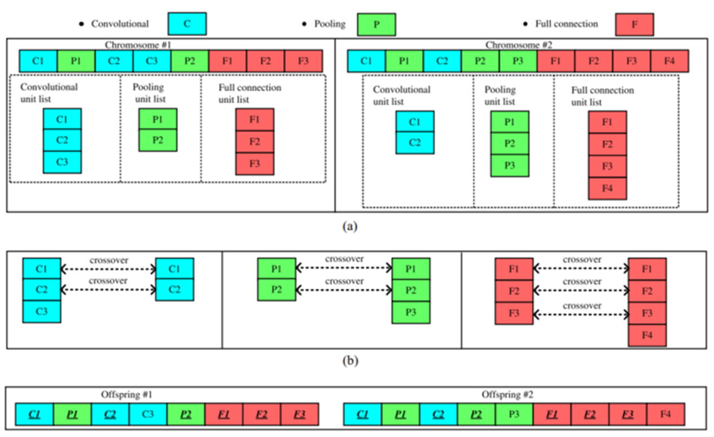
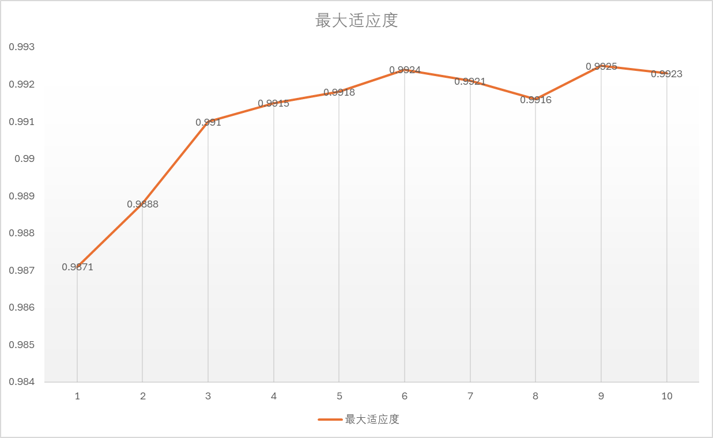
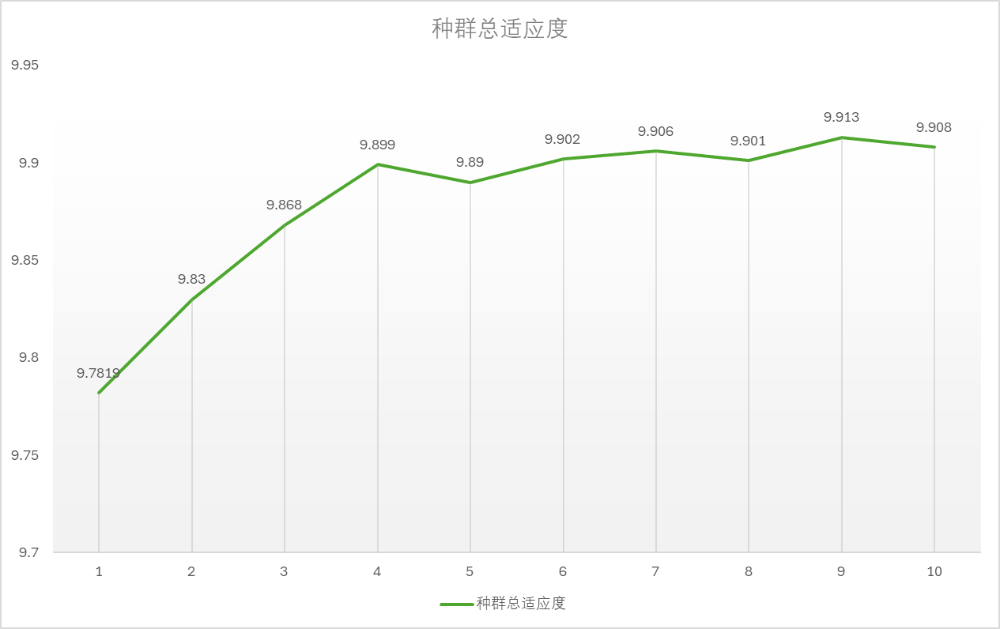

# 遗传算法优化神经网络模型

| 姓名 | 学号 | 班级 |
| :--: | :--: | :--: |
| xxx | xxx | xxx |

利用遗传算法搜索出最优的CNN模型（CNN结构及结构参数），该CNN用于实现MNIST手写数字识别。

## 一、预备知识

### 卷积神经网络

卷积层通常用作对输入层输入数据进行特征提取，通过卷积核矩阵对原始数据中隐含关联性的一种抽象。卷积操作原理上其实是对两个像素矩阵进行点乘求和的数学操作，其中一个矩阵为输入的数据矩阵，另一个矩阵则为卷积核，求得的结果表示为原始图像中提取的特定局部特征。

激活层负责对卷积层抽取的特征进行激活，由于卷积操作是由输入矩阵与卷积核矩阵进行相乘的过程，是线性变化关系，**需要激活层对其进行非线性的映射**。激活层主要由激活函数组成，即在卷积层输出结果的基础上嵌套一个非线性函数，让输出的特征图具有非线性关系。卷积网络中通常采用$ReLU$来充当激活函数。

池化层作用是对感受域内的特征进行筛选，提取区域内最具代表性的特征，能够有效地降低输出特征尺度，进而**减少模型所需要的参数量**。通常分为最大池化、平均池化和求和池化，它们分别提取感受域内最大、平均与总和的特征值作为输出，最常用的是**最大池化**。

全连接层负责对卷积神经网络学习提取到的特征进行汇总，将多维的特征输入映射为二维的特征输出，高维表示样本批次，低维常常对应任务目标。

### 遗传算法

遗传算法（Genetic Algorithm，简称GA）是一种随机全局搜索优化方法，它模拟了自然选择和遗传中发生的复制、交叉和变异等现象，从任一初始种群出发，通过随机选择、交叉和变异操作，产生一群更适合环境的个体，使群体进化到搜索空间中越来越好的区域，这样一代一代不断繁衍进化，最后收敛到一群最适应环境的个体，从而求得问题的优质解。

染色体又可称为个体，一定数量的个体组成了群体，群体中个体的数量叫做群体大小。

适应度：各个个体对环境的适应程度叫做适应度。为了体现染色体的适应能力，引入了对问题中的每一个染色体都能进行度量的函数，叫适应度函数。这个函数通常会被用来计算个体在群体中被使用的概率。

### 遗传算法实现过程

* 染色体编码：常见的编码方法有二进制编码、格雷码编码、 浮点数编码、各参数级联编码、多参数交叉编码等。
* 初始种群生成：随机生成指定数量个体作为初始化种群。
* 个体评估：使用适应度函数计算每个个体的适应度。
* 选择：从旧群体中以一定概率选择优良个体组成新的种群，以繁殖得到下一代个体。
* 交叉：从种群中随机选择两个个体，通过两个染色体的交换组合，把父串的优秀特征遗传给子串，从而产生新的优秀个体。
* 变异：为了防止遗传算法在优化过程中陷入局部最优解，在搜索过程中，需要对个体进行变异。

## 二、实验预备

### 遗传算法的主要参数设置

* 种群个体数：10
* 变异率：0.1
* 交叉率：0.8
* 卷积和池化层总数的最大值：6
* 全连接层个数的最大值：3

### 染色体编码

考虑到卷积神经网络的深度是不可知的，我们采用了可变长的编码策略。

1. **不同网络层的组合**

    激活函数固定为$ReLU$。在本次实验的网络中，我们规定**每个卷积层后面都跟着一个$ReLU$函数**，除了最后一层的全连接层，**每个全连接层后面都跟着一个$ReLU$函数**。

    为了简化问题且结合构建网络的实际经验，我们的网络**第一个网络层一定是卷积层，最后一个网络层一定是全连接层**。且卷积层和池化层都分布在网络的前半部分，全连接层都分布在网络的后半部分。

2. **每个网络层的参数**

    在该实验的卷积神经网络中，总共有三种类型的网络层，包括卷积层、池化层和全连接层。对于不同类型的网络层，我们要确定的结构参数类型和个数不同，具体如下：

   * 卷积层（C）：输入通道数、输出通道数、卷积核大小、步幅和padding
   * 池化层（P）：池化层类型、池化核大小、步幅和padding
   * 全连接层（F）：输入特征数和输出特征数

    结合本实验的实际问题，输入图片的通道数为**1**，且对于卷积层来说，其输入通道数由之前的网络层决定，所以，我们只要确定每个卷积层的输出通道数即可。**池化层类型固定为最大池化**，所有卷积核都为方形。

    对于全连接层来说，其输入特征数由之前的网络决定，所以我们只需要确定每个全连接层的输出特征数即可。由于最后一个全连接层的输出特征数一定为**10**，所以在我们的染色体编码中，我们**不会编码最后一个全连接层**。

    为了缩小要搜索参数的空间范围，对于卷积层，我们要求特征图在卷积前后大小保持一致（或相差1），由算法自动确定卷积层的padding，即我们**不会在染色体中编码卷积层的padding**；对于池化层，其padding固定为0，即我们也**不会在染色体中编码池化层的padding**。

    为了缩小要搜索参数的空间范围且结合实际经验，对于所有要编码的参数我们不是任意选取，而是要**从给定的集合中选取**。

    综上，我们要在染色体中编码的参数如下：

    * 卷积层
      * 卷积核大小：`[3, 5, 7]`
      * 步幅：`[1, 2, 3]`
      * 输出通道数：`[32, 64, 128, 192, 256]`
    * 池化层
      * 池化核大小：`[2, 3, 4]`
      * 步幅：`[1, 2]`
    * 全连接层
      * 输出特征数：`[32, 64, 128, 192, 256]`

3. **实际的染色体编码**

    在实验中，我们采用了数组来编码染色，接下来举例说明编码的实际含义。`['C', 3, 3, 32, 'P', 2, 1, 'C', 7, 1, 256, 'P', 2, 2, 'F', 256, 'F', 32]`，该染色体所代表的卷积神经网络结构如下：

    * 卷积层，其卷积核大小为$3$、步幅为$3$、输出通道数为$3$
    * $ReLU$层
    * 池化层，其池化核大小为$2$、步幅为$1$
    * 卷积层，其卷积核大小为$7$、步幅为$1$、输出通道数为$256$
    * $ReLU$层
    * 池化层，其池化核大小为$2$、步幅为$2$
    * 全连接层，其输出特征数为$256$
    * $ReLU$层
    * 全连接层，其输出特征数为$32$
    * $ReLU$层
    * 全连接层，其输出特征数为$10$

## 三、遗传算法实现过程详解

### 初始化种群（Initialization）

在进行种群初始化时，我们将每一个染色体分为两个部分，第一个部分包括卷积层和池化层，第二部分是全连接层。我们首先初始化第一部分，之后再初始化第二部分。

初始化第一部分时，首先随机获取卷积层和池化层的总个数。第一个网络层一定是卷积层，之后以$0.8$的概率添加池化层，以$0.2$的概率添加卷积层，这是为了符合通常的**卷积层 -> ReLU -> 池化层**的网络结构。

初始化第二部分时，首先随机获取全连接层的总个数，注意这里**需要减去最后一个全连接层**。

生成染色体后，我们还会检查该染色体是否合法，即能否构成神经网络。如果不合法，则重新生成。最终通过循环生成指定个体数目的种群。

这部分代码对应于`GN`类的`_initialize`方法。

```python
def _initialize(self) -> list:
    """ 初始化种群 """
    P = []
    num = 0 # 当前生成的合法个体数
    while num < self.N:
        n_cp = random.randint(1, self.max_cp) # 卷积层和池化层总个数
        p = []
        flag = True # 用于控制第一个层必须为卷积层
        last = None # 用于记录上一个层是卷积层还是池化层
        for _ in range(n_cp):
            r = random.random()
            # 当上一层是卷积层时有0.2的概率继续生成卷积层
            # 当上一层是池化层时有0.8的概率生成卷积层
            if flag or (last == 'C' and r < 0.2) or (last == 'P' and r < 0.8):
                p.extend(self._gen_C())
                flag = False
                last = 'C'
                
            else:
                p.extend(self._gen_P())
                last = 'P'

        
        n_f = random.randint(0, self.max_f - 1) # 全连接层个数
        for _ in range(n_f):
            p.extend(self._gen_F())

        # 判断当前生成的个体是否合法
        if self._is_vaild(p):
            P.append(p)
            num += 1
        else:
            dprint(f'初始化种群时，个体 {p} 不合法，被舍弃，重新生成')

    self.population = P
    return P
```

### 评估（Evaluation）

计算种群中每个个体的适应度。这里我们选择的适应度函数为每个模型在测试集上的准确率。

这部分代码对应于`GN`类的`_evaluate`方法。

```python
def _evaluate(self):
    """ 评估，计算每个个体的适应度 """
    fitness = []
    for i, item in enumerate(self.population):
        dprint(f'第 {i+1} 个个体网络结构 {item}')
        accuracy = train_and_test(item)
        fitness.append(accuracy)
        dprint(f'第 {i+1} 个个体准确率 {accuracy}')
    self.fitness = fitness
    return fitness
```

### 交叉（Crossover）

将种群中的两个个体的染色体进行交叉，从而产生两个子代。由于不同的染色体长度是不同的，所以需要对交叉过程进行一些特殊处理。这部分过程参考了论文中给出的方法，具体过程如下：



* 将每条染色体中的卷积层、池化层和全连接层按照原来的排列顺序分别放到不同的单元数组中，这样2条染色体就会得到6个单元数组。
* 将这两条染色体的相同单元数组按头对齐，并执行交叉运算。
* 完成交叉操作后，两条染色体按照原来的排列顺序组装成两条新的染色体。

这部分代码对应于`GN`类的`_crossover`方法。

```python
def _crossover(self, parent1: list, parent2: list):
    """ 交叉产生下一代 """
    parent1_S = self._get_structure(parent1)
    parent2_S = self._get_structure(parent2)
    child1 = None
    child2 = None

    while True:
        child1 = parent1.copy()
        child2 = parent2.copy()

        for t in ['C', 'P', 'F']:
            r = random.random()
            if r < self.crossover_rate:
                len1 = len(parent1_S[t])
                len2 = len(parent2_S[t])
                len_min = min(len1, len2)
                # 如果长度为0，则跳过
                if len_min == 0:
                    continue
                
                pos = random.randint(0, len_min) # 交叉的基因个数
                length = self.type_len[t]
                for i in range(pos):
                    index1 = parent1_S[t][i][0]
                    index2 = parent2_S[t][i][0]
                    child1[index1:index1+length] = parent2[index2:index2+length]
                    child2[index2:index2+length] = parent1[index1:index1+length]
        
        if self._is_vaild(child1) and self._is_vaild(child2):
            break
        else:
            dprint(f'交叉过程中，子代 {child1} 或子代 {child2} 不合法，被舍弃，重新生成')

    return child1, child2
```

### 变异（Mutation）

对选定染色体的选定网络层，分别按照$\frac{1}{3}$的概率进行删除、修改或增加一个新的网络层。

对于卷积层或池化层来说，分别按照$\frac{1}{2}$的概率修改或增加为新的卷积层或池化层；对于全连接层，修改或增加的仍然是全连接层。

在删除、修改或增加过程中，我们要保证第一层网络一定是卷积层。

这部分代码对应于`GN`类的`_mutate`方法。

```python
def _mutate(self, individual: list):
    """ 对个体进行变异 """
    individual_S = self._get_structure(individual)
    len_total = len(individual_S['C']) + len(individual_S['P']) + len(individual_S['F'])
    new_I = None
    while True:
        new_I = individual.copy()
        r_ = random.random()
        if r_ < self.mutation_rate:
            # 选择某个基因进行变异
            select_gene = random.randint(0, len_total-1)
            select_i = None
            select_type = None
            select_len = None
            i = 0
            temp = 0
            while i < len(individual):
                type = individual[i]
                length = self.type_len[type]
                if temp == select_gene:
                    select_i = i
                    select_type = type
                    select_len = length
                temp += 1
                i += length
            
            r = random.random() # 用于选择该基因是改变、删除、增加
            if r < 1 / 3:
                # 删除基因
                if select_gene == 0: # 不能删除第一个基因
                    continue
                
                new_I = new_I[:select_i] + new_I[select_i+select_len:]
                dprint(f'delete: before {individual}; after {new_I}')
                
            elif r < 2 / 3:
                # 改变基因
                new = None
                if select_type == 'C':
                    if select_gene == 0: # 确保第一个层永远为卷积层
                        new = self._gen_C()
                    else:
                        new = self._gen_C() if random.random() < 0.5 else self._gen_P()
                elif select_type == 'P':
                    new = self._gen_P() if random.random() < 0.5 else self._gen_C()
                elif select_type == 'F':
                    new = self._gen_F()
                
                new_I[select_i:select_i+select_len] = new
                dprint(f'modify: before {individual}; after {new_I}')

            else:
                # 增加基因
                new = None
                if select_type == 'C':
                    if select_gene == 0: # 确保第一个层永远为卷积层
                        new = self._gen_C()
                    else:
                        new = self._gen_C() if random.random() < 0.5 else self._gen_P()
                elif select_type == 'P':
                    new = self._gen_P() if random.random() < 0.5 else self._gen_C()
                elif select_type == 'F':
                    new = self._gen_F()

                new_I = new_I[:select_i] + new + new_I[select_i:]
                dprint(f'add: before {individual}; after {new_I}')
                
        if self._is_vaild(new_I):
            break
        else:
            dprint(f'变异过程中，个体 {new_I} 不合法，被舍弃，重新生成')
            
    return new_I
```

### 选择（Selection）

在每次世代交替时，一般来说适应度更高的个体会被选择来产生下一代。常见的选择策略有轮盘赌选择、锦标赛选择和随机全局采样。

这里我们对**后期**的选择策略进行了特殊处理。由于我们选择的适应度函数为相应个体在测试集上的准确率，所以不同个体的适应度实际上差别并不大，**直接用轮盘赌对优秀个体并没有良好的选择效果**。

我们首先将每个个体的适应度减去$0.98$，然后将小于$0$的适应度赋值为$0$，即剔除了准确率在$0.98$以下的个体，之后对适应度非$0$个体乘$10$。为了扩大不同适应度个体的差距，我们选择了**指数函数**加大不同个体的差距。

计算完新的适应度后，我们采用轮盘赌法每次从种群中选取两个个体，接着对这两个个体进行交叉，对他们所生成的后代进行变异。

这部分代码对应于`GN`类的`_run`方法。

```python
next_P = []
if e < len(Data.population_list):
    next_P = Data.population_list[e]
else:
    parent_probabilities = self.fitness.copy()
    not_zero_num = 0
    for i in range(len(parent_probabilities)):
        parent_probabilities[i] -= 0.98
        if parent_probabilities[i] <= 0:
            parent_probabilities[i] = 0
        else:
            parent_probabilities[i] = math.pow(10, 10 * parent_probabilities[i])                        
            not_zero_num += 1
    if not_zero_num < 2:
        parent_probabilities = self.fitness.copy()
    parent_probabilities = parent_probabilities / np.sum(parent_probabilities)
    for i in range(0, self.N, 2):
        # 采用轮盘赌算法选择父体
        parent1, parent2 = random.choices(self.population, k=2, weights=parent_probabilities)
        child1, child2 = self._crossover(parent1, parent2)
        child1 = self._mutate(child1)
        child2 = self._mutate(child2)
        next_P.append(child1)
        next_P.append(child2)
    Data.population_list.append(next_P)

self.population = next_P
```

### 终止（Termination）

我们的终止条件是代数大于$50$代或某代种群的最大准确率达到了$0.995$以上。

## 四、结果分析





筛选出的最大准确率为$99.25\%$，其网络结构为`['C', 7, 1, 192, 'C', 3, 2, 128, 'P', 2, 2, 'C', 3, 2, 256]`。

1. 从上面的图可以看出，遗传算法确实起到了一定作用，使得每一代种群的最大准确度和总适应度之和基本呈现上升趋势。但由于种群的数量过少，使得后期呈现稳定趋势，达到了局部最优。

2. 在搜索过程中，种群的多样性逐步下降，在经过10代的搜索后，种群中所有个体都成为一致的。这使得算法逐步陷入局部最优，未来应该要加大种群数量进行测试。

3. 选择操作对种群多样性有很大影响，最佳的选择策略为**前松后紧**，从而避免过早收敛或陷入局部最优。

## 五、优缺点分析和未来的改进

### 优点

1. 对随机生成、交叉、变异的染色体进行了判断，防止出现不合法的染色体无法构成卷积神经网络。具体的代码位于`GN`类的`_is_vaild`方法。
2. 在初始化种群时，对于卷积层和池化层并不是随机生成，而是采用了常见的**卷积层 -> ReLU -> 池化层**的网络模块来按照一定概率来生成。避免了连续的池化层出现从而导致信息丢失。
3. 对于卷积层，没有使用默认初始化而是使用了效果更好的`kaiming_normal_`。
4. 设计了记录数据类`Data`，记录训练过程中每代的种群和适应度。这样可以随时停止训练，之后重新开始后再接着上一次继续训练。
   1. 在实际训练过程中，该方法起到了很好的效果。有时在训练几个小时后要发现超参数效果不好或子代选择算法不好，这时便可以停止训练进行修改。这个方法节省了时间，避免了“前功尽弃”。
5. 使用TensorBoard实现训练过程可视化。
6. 在卷积层和全连接层后面都使用$ReLU$函数，从而增强模型的非线性性。

### 缺点及改进

1. 限于自身电脑显卡的条件约束，本实验的参数都尽可能小。
   1. 种群个体数为10：在本次实验中证明**这个选择是错误的**，它导致了种群的多样性减少，出现了在第10轮的训练中所有个体都相同的现象。
   2. 训练epoch为10：出现了在以后几代的种群中没有多余全连接层的现象，本人推测全连层需要更多的迭代次数来进行训练，而epoch太少导致含有两个及以上全连接层的网络效果没有达到最佳。
2. 时间原因没有对超参数进行更多尝试。
3. 由于神经网络的训练时间长，且遗传算法属于随机搜索，其交叉和变异没有具体的理论支持，因此本人感觉遗传算法寻找最优网络结构的方法是不现实的。
4. 后期的选择策略选择性太强，使得模型提前陷入了局部最优解，未来要更改选择策略。
