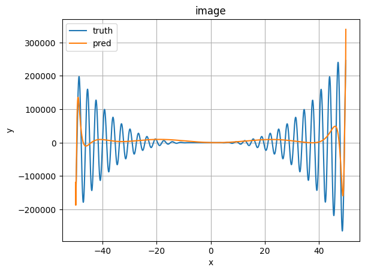

# 非线性函数拟合

参考线性回归模型训练方法，利用均方误差、梯度下降训练模型，用多项式函数拟合如下非线性函数：$f(x)=2x\cos{(2x)}(x^2+7x+1)$。

|姓名|学号|班级|
|:-:|:-:|:-:|
|xxx|xxx|xxx|

## 一、实现步骤

### 生成带噪声的样本数据

在要拟合范围内进行**均匀采样**，带入目标函数，并添加噪声，生成规定数量的数据集。

```python
target_func = lambda x: 2 * x * np.cos(2 * x) * (x * x + 7 * x + 1)
target_func_derivative1 = lambda x: (6*x*x + 28*x + 2) * np.cos(2*x) - (4*x*x*x + 28*x*x + 4*x) * np.sin(2*x) # 目标函数的一阶导数

def generate_dataset(num_samples: int, is_train: bool):
    X = np.random.uniform(Config.range[0], Config.range[1], num_samples)
    noise = None
    if is_train:
        noise = np.random.normal(Config.noise_mean, Config.noise_std, num_samples)
    else:
        noise = 0
    Y = target_func(X) + noise
    Y_d = target_func_derivative1(X)
    X = X / Config.range[1]
    return (X, Y, Y_d)

train_X, train_Y, train_Y_d = generate_dataset(Config.train_dataset_sample_num, True)
```

### 数据迭代器

这里我手动实现了数据迭代器，原理是通过使用`numpy`的`shuffle`函数来对索引值打乱，然后使用`yield`生成器构造数据迭代器。

```python
def data_iter(X, Y, Y_d, batch_size, is_train: bool):
    num_samples = len(X)
    indices = np.arange(num_samples) 
    # 如果是训练模式，则打乱读取样本数据
    if is_train:
        np.random.shuffle(indices)
    for i in range(0, num_samples, batch_size):
        batch_indices = indices[i: min(i+batch_size, num_samples)]
        yield X[batch_indices], Y[batch_indices], Y_d[batch_indices]
```

### 线性模型（前向传播）

通过调用`numpy`的计算和变换函数来计算$w_0+w_1x+w_2x^2+...+w_nx^n$。

```python
def linear_net(x, w):
    func_order = len(w) - 1 # 函数次数
    x = np.repeat(x, func_order + 1).reshape((-1, func_order + 1)) # 将x改为[[x_1, ..., x_1], ..., [x_n, ..., x_n]]
    w = np.tile(w, (len(x), 1)) # 将w改为[[w_1, ..., w_m], ..., [w_1, ..., w_m]]
    order_list = np.arange(0, func_order + 1) # x的次数列表
    grad = np.power(x, order_list)
    output = np.nansum(w * grad, axis=1)
    coefficient = np.arange(1, func_order + 1)
    coefficient = np.tile(coefficient, (len(x), 1))
    grad_d = grad[:, :-1] * coefficient
    output_d = np.nansum(w[:, 1:] * grad_d, axis=1)
    grad_d = np.hstack((np.zeros((len(x), 1)), grad_d[:, :]))
    return output, output_d, grad, grad_d # 计算 w_m * x^n + ... + w2 * x + w-1
```

### loss计算

采用$MSE$来计算损失值，其公式为$MSE=\frac{1}{2}\sum_i(y_i-\hat{y}_i)^2$。

```python
def loss(y_hat, y, y_d_hat, y_d):
    loss = Config.loss_ratio[0] * np.power(y_hat-y, 2) / 2 + Config.loss_ratio[1] * np.power(y_d_hat-y_d, 2) / 2
    return loss
```

### 训练过程

梯度计算公式为：$\nabla_w=\frac{\partial loss}{\partial w}$，反向传播计算公式为：$w=w-\eta\nabla_w$。

```python
def train():
    global weight
    loss_list = []
    for e in range(Config.num_epochs):
        for i, (X, Y, Y_d) in enumerate(data_iter(train_X, train_Y, train_Y_d, Config.batch_size, True)):
            output, output_d, grad, grad_d = linear_net(X, weight)
            l = loss(output, Y, output_d, Y_d)
            grad_w = (Y - output).reshape(-1, 1) * grad * Config.loss_ratio[0] + (Y_d - output_d).reshape(-1, 1) * grad_d * Config.loss_ratio[1]
            delta = Config.lr * grad_w.mean(axis=0)
            weight = weight + delta
            print(weight)
            print(f'Epoch {e} Loss {l.mean()}')
            loss_list.append(l.mean())
    
    # 绘制训练过程中的损失函数
    plt.plot(np.arange(len(loss_list)), loss_list)
    plt.xlabel('i')
    plt.ylabel('loss')
    plt.title('The loss of train process')
    plt.grid(True)
    plt.show()
```

## 二、实验过程

### 没有采用任何措施

1. 拟合$[-1, 1]$之间的函数
   * 学习率：0.1
   * 噪声正态分布均值：0
   * 噪声正态分布均值：0.01
   * 训练样本数：500000
   * 批大小：1024
   * 训练轮数：30
   * 拟合函数次数：9
   * `[ 0.63142571 1.44661364 3.522355 -0.7032608 -1.37391229 -2.01923118 -6.19228747 0.8035383 -3.39651833 -1.5895166 ]`
    

2. 拟合$[-3, 3]$之间的函数
   * 学习率：1e-4
   * 噪声正态分布均值：0
   * 噪声正态分布均值：0.1
   * 训练样本数：500000
   * 批大小：1024
   * 训练轮数：30
   * 拟合函数次数：5
   * `[ -2.63094827 -1.51079276 -20.53626988 -3.66545343 3.91408019 0.69880926]`
    

3. 拟合$[-10, 10]$之间的函数
    在该范围内，我尝试调节学习率和拟合函数次数，发现拟合的效果并不好：**损失值很大，训练时无法有效降低；学习率必须设置地很低（1e-15以下），否则会出现梯度爆炸；无法继续轻松升高拟合函数次数**。
    

### 将$x$的范围调整到$[-1, 1]$

在没有采取任何措施时，我发现在数据$[-1, 1]$范围内，学习率可以设置地较大（1e-1都可以），且拟合函数的次数几乎可以任意选取。所以，我把数据$x$通过除以`Config.range[1]`来调整到$[-1, 1]$范围内。

1. 拟合$[-5, 5]$之间的函数
   * 学习率：0.5
   * 噪声正态分布均值：0
   * 噪声正态分布均值：0.1
   * 训练样本数：500000
   * 批大小：1024
   * 训练轮数：30
   * 拟合函数次数：50

    ```none
    [ -31.38616732  -83.23138555  259.6796915   609.24282187  486.45926136
    -189.39162314 -505.56732134 -500.14433517 -771.43881271 -460.74139912
    -619.55532626 -300.70689087 -350.89537798 -130.3822591   -99.5733022
        6.52823889   88.90357692  103.04941243  212.74672443  160.04150048
    283.08167869  191.17711924  309.84264459  196.87677796  304.98509534
    189.31232458  282.86036908  169.59443977  244.66338532  140.64281007
    199.7462577   110.5782674   152.95203646   77.42951833   98.50291699
    43.27758561   46.61507308    9.49423605   -2.44307245  -24.3240064
    -50.38855136  -56.22370859  -94.82810997  -84.99616514 -136.2760611
    -113.14116593 -176.42600811 -140.30392348 -212.22990153 -163.55240114
    -246.42362781]
    ```

    

2. 拟合$[-10, 10]$之间的函数
   * 学习率：0.5
   * 噪声正态分布均值：0
   * 噪声正态分布均值：0.1
   * 训练样本数：500000
   * 批大小：1024
   * 训练轮数：30
   * 拟合函数次数：50

    ```none
    [  -62.49418703   166.58063643  1380.70824752   852.46466479
    -2383.95591693 -3297.72344201 -2423.02327812 -2156.03976513
    -466.69940831   313.08071478  1381.49902553  2167.19847839
    2413.912525    3014.80939833  2653.89500522  3056.65816421
    2359.75343996  2592.72685232  1783.23811125  1891.16651877
    1110.78055558  1123.27183205   458.55293811   403.38848006
    -104.34902542  -208.23021967  -554.81446275  -687.51360229
    -883.13240114 -1035.14819941 -1090.86271427 -1250.09164674
    -1192.6758402  -1354.41197133 -1200.52484525 -1356.65877347
    -1133.52665256 -1274.5410919  -1001.30353591 -1126.65835718
    -819.53670511  -920.43206503  -598.58712924  -675.24708421
    -347.1558873   -393.24707773   -75.55801116   -86.25726374
    213.48293017   234.95782647   510.20381361]
    ```

    

3. 拟合$[-50, 50]$之间的函数
   * 学习率：1
   * 噪声正态分布均值：0
   * 噪声正态分布均值：1
   * 训练样本数：500000
   * 批大小：1024
   * 训练轮数：15
   * 拟合函数次数：1000

    

### 将$Y$的范围调整到$[-1, 1]$

在经过上一步骤后，我可以轻松地调整学习率和拟合函数的次数，但是出现了损失值无法有效下降的现象。接下来通过将$Y$除以`(2 * Config.range[1] ** 3 + 14 * Config.range[1]**2 + 2 * Config.range[1])`调整$Y$的范围大体为$[-1, 1]$。**但是发现效果并不明显**。

1. 拟合$[-50, 50]$之间的函数
   * 学习率：1
   * 噪声正态分布均值：0
   * 噪声正态分布均值：1
   * 训练样本数：500000
   * 批大小：1024
   * 训练轮数：1000
   * 拟合函数次数：500

    

### 给不同次方的$x$设置不同的学习率

由于在上面的步骤中，我把$x$的范围调整到了$[-1, 1]$范围内，所以高次项的系数其实也会缩放到原来的$\frac{1}{10^i}$倍，这会导致高次项系数无法有效学习的结果。如上面的试验中，即使我的拟合函数次数很高，但其实大多数高次项是无效的。

通过给不同次数的$x^i$的$w_i$系数设置不同的学习率，可以在一定程度上改变这一点。

```python
def gen_lr_list():
    base_lr = 0.1
    for i in range(Config.fitting_order + 1):
        Config.lr_list.append(base_lr * (i+1))
```

1. 拟合$[-10, 10]$之间的函数
   * 学习率：0.1起
   * 噪声正态分布均值：0
   * 噪声正态分布均值：0.1
   * 训练样本数：500000
   * 批大小：1024
   * 训练轮数：100
   * 拟合函数次数：20

    ```none
    [-3.23792594e+01 -9.41341025e+02 -9.77302678e+01  9.08891094e+03
    6.52229141e+03 -1.10111141e+04 -1.14306609e+04 -1.63758040e+04
    -1.17643820e+04 -1.97295514e+03  1.38877842e+03  1.61260308e+04
    1.44518872e+04  2.48445339e+04  1.89957294e+04  1.86902480e+04
    1.25965844e+04 -2.39482296e+03 -3.59720566e+03 -3.57618976e+04
    -2.69723130e+04]
    ```

    

2. 拟合$[-10, 10]$之间的函数
   * 学习率：0.1起
   * 噪声正态分布均值：0
   * 噪声正态分布均值：0.1
   * 训练样本数：500000
   * 批大小：1024
   * 训练轮数：200
   * 拟合函数次数：50

    ```none
    [-1.71445679e+00 -7.31976087e+02 -9.97798704e+02  5.75222180e+03
    8.23524469e+03 -2.88995621e+03 -7.34982425e+03 -1.19125484e+04
    -1.26321783e+04 -8.84410421e+03 -6.22645910e+03  6.60898579e+02
    3.58322079e+03  9.58199438e+03  1.09758598e+04  1.44695110e+04
    1.39805970e+04  1.48753786e+04  1.29877735e+04  1.18397027e+04
    9.30617464e+03  6.82663855e+03  4.34783002e+03  1.17751805e+03
    -7.49841152e+02 -4.10215279e+03 -5.19994029e+03 -8.36010534e+03
    -8.54157184e+03 -1.12557312e+04 -1.05775948e+04 -1.26730463e+04
    -1.12985042e+04 -1.26517172e+04 -1.08061923e+04 -1.13382694e+04
    -9.27824834e+03 -8.93829485e+03 -6.92195238e+03 -5.67364291e+03
    -3.95697493e+03 -1.77612315e+03 -5.96481312e+02  2.53512604e+03
    2.96444705e+03  7.05548058e+03  6.54795620e+03  1.16101007e+04
    1.00018474e+04  1.60381003e+04  1.32005553e+04]
    ```

    

### 损失函数增加一项：一次导的MSE

如果要两个函数的图像相似，不仅要求两个函数在某一处的函数值相近，而且要求该处一次导值相近。按照这一思路，我修改了损失函数的表示为**函数值的均方误差损失和一次导的均方误差损失**。

```python
def loss(y_hat, y, y_d_hat, y_d):
    loss = Config.loss_ratio[0] * np.power(y_hat-y, 2) / 2 + Config.loss_ratio[1] * np.power(y_d_hat-y_d, 2) / 2
    return loss
```

1. 拟合$[-1, 1]$之间的函数
   * 学习率：0.1
   * 训练样本数：1000000
   * 批大小：1024
   * 训练轮数：5000
   * 拟合函数次数：10

    ```none
    [  0.15161529   1.99199142  10.80443736  -2.09495486 -15.92212459
    -2.02365839  -5.54076184   0.13629079   3.41241406   0.33628505
    1.27392066]
    ```

    

但是由于我压缩了$x$的范围，所以其导数也会发生一定变化，这一变化导致了我放弃了该方法。

### 分段训练

每次训练不同的次数前面的系数，但是该方法的效果很糟糕，所以舍弃了。

### 其他方式的思考

1. 正则化
    因为总体来看我的效果是欠拟合状态，而正则化是为了防止过拟合，所以这里我没有使用正则化。

2. 引入噪声
   由于采样数足够多，而在测试时也没有跑出预定范围，所以噪声的添加与否应该是无足轻重的。

3. 梯度截断
   在将$x$缩放到$[-1, 1]$内之后，梯度不会出现爆炸现象，所以梯度截断这个操作在我实现中显得多余了；而且在实验中，当我不压缩$x$的范围而采用梯度截断这一方法时的效果明显弱于压缩$x$范围的效果。

## 三、使用MLP来拟合非线性函数

我尝试了使用MLP来拟合该线性函数，其效果是优于多项式函数拟合效果的。

### 没有采用任何措施

1. 拟合$[-10, 10]$之间的函数
   * 学习率：0.005
   * 噪声正态分布均值：0
   * 噪声正态分布均值：0.1
   * 训练样本数：500000
   * 批大小：1024
   * 训练轮数：30
   * MLP结构：$1\times100 \rightarrow ReLU \rightarrow 100\times100 \rightarrow ReLU \rightarrow 100\times1$

    

2. 拟合$[-50, 50]$之间的函数
   * 学习率：0.005
   * 噪声正态分布均值：0
   * 噪声正态分布均值：0.1
   * 训练样本数：500000
   * 批大小：1024
   * 训练轮数：30
   * MLP结构：$1\times100 \rightarrow ReLU \rightarrow 100\times100 \rightarrow ReLU \rightarrow 100\times1$

    

### 将$x$缩放到$[-1, 1]$范围内

1. 拟合$[-10, 10]$之间的函数
   * 学习率：0.01
   * 噪声正态分布均值：0
   * 噪声正态分布均值：0.1
   * 训练样本数：1000000
   * 批大小：1024
   * 训练轮数：30
   * MLP结构：$1\times100 \rightarrow ReLU \rightarrow 100\times100 \rightarrow ReLU \rightarrow 100\times1$
  
    

2. 拟合$[-20, 20]$之间的函数
   * 学习率：0.01
   * 噪声正态分布均值：0
   * 噪声正态分布均值：0.1
   * 训练样本数：1000000
   * 批大小：1024
   * 训练轮数：30
   * MLP结构：$1\times400 \rightarrow ReLU \rightarrow 400\times400 \rightarrow ReLU \rightarrow 400\times400 \rightarrow ReLU \rightarrow 400\times1$
  
    

3. 拟合$[-50, 50]$之间的函数
   * 学习率：0.5
   * 噪声正态分布均值：0
   * 噪声正态分布均值：0.1
   * 训练样本数：100000
   * 批大小：1024
   * 训练轮数：50
   * MLP结构：$1\times2048 \rightarrow ReLU \rightarrow 2048\times2048 \rightarrow ReLU \rightarrow 2048\times2048 \rightarrow ReLU \rightarrow 2048\times1$
  
    

## 四、使用$pytorch$来线性拟合

在我能想到的所有方法都尝试后，我想到了$Adam$优化器。所以我又通过调用$pytorch$库来测试$Adam$优化器是否有效。

首先令我震惊的是：如果使用$Adam$优化器拟合$[-5, 5]$范围内的函数，不用调整$x$的范围为$[-1, 1]$也不会出现梯度爆炸，这说明该优化器内部可能做了某些特殊处理；但是效果一般。


在将$x$范围压缩到$[-1, 1]$内后，测试的效果不如手写版本的。


## 五、结论与心得

### 结论

1. 在拟合$[-10, 10]$范围内的函数图像时，我取得的最好效果是采用$20$次函数拟合，效果如下：
    
2. 对应系数为：`[-32.3792594, -94.1341025, -0.9773026780000001, 9.088910940000002, 0.6522291410000001, -0.11011114100000004, -0.011430660900000006, -0.0016375804000000006, -0.00011764382000000006, -1.972955140000001e-06, 1.388778420000001e-07, 1.612603080000001e-07, 1.4451887200000008e-08, 2.4844533900000017e-09, 1.8995729400000014e-10, 1.8690248000000016e-11, 1.259658440000001e-12, -2.3948229600000024e-14, -3.597205660000004e-15, -3.5761897600000034e-15, -2.697231300000003e-16]`
3. 在没有压缩$x$的范围时，模型的学习很容易受到拟合函数次数的影响，且学习率需要根据拟合函数次数和拟合范围进行相应调整；经过压缩$x$范围后，模型的学习是稳定的，学习率的影响也较小

### 心得

1. 训练MLP
   * 在达到一定深度后，我发现加宽网络比加深网络效果好
   * 网络的容量很重要，在训练网络时，时常会出现网络效果倒退的现象，在扩大容量后，往往这一现象得到了改善
   * 实测$Adam$优化器的效果要优于$SGD$优化器

2. 线性拟合
   * 将$x$压缩到$[-1, 1]$之间的方法虽然可以缓解梯度爆炸的问题，但是也带来了高次项难以学习的困难，但是如果不压缩范围就会轻易出现梯度爆炸现象，这时就要进行权衡，最终我选择了前者。
   * 对不同系数设置不同的学习率可以在一定程度上缓解压缩范围带来的的高次项难以学习的困难。

## 六、附录

* ***linear.ipynb***：手写版的线性拟合代码文件
* ***linear_lib.ipynb***：使用pytorch版的线性拟合代码文件
* ***mlp.ipynb***：使用MLP进行拟合的代码文件
