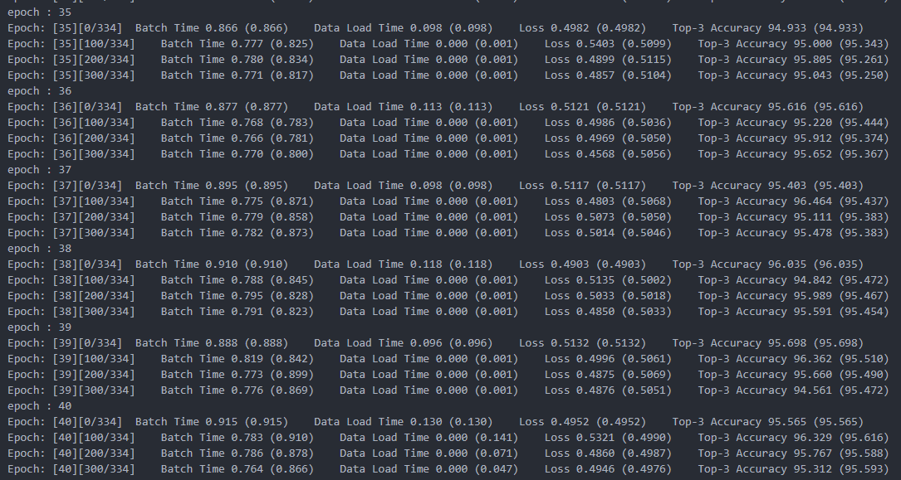

# 图像变化描述

实现对多幅图像的自然语言变化描述生成（time series Image Change Caption）：提供baseline论文和源码，baseline可以处理两幅图像的输入，即生成两相图像的变化描述，本作业目标是将其改造为对多幅图像的变化进行描述。

* 基本要求：将baseline改造为可接受多幅图像输入后，训练数据使用多图像变化描述数据。
* 高阶要求：将baseline改造为可接受多幅图像输入后，训练数据仅采用两相图像，能够实现多时相图像变化描述生成。

|姓名|学号|班级|
|:-:|:-:|:-:|
|xxx|xxx|xxx|

## 一、问题分析与总体思路

Transformer模型主要由以下两部分组成：

* 编码器（Encoder）：负责将输入序列（如一个句子）转换为一个包含丰富上下文信息的向量序列。编码器通常由多个相同的层堆叠而成，每一层都包含一个自注意力子层和一个前馈神经网络子层。
* 解码器（Decoder）：负责根据编码器输出的向量序列生成目标序列（如翻译后的句子）。解码器也包含多个相同的层，但与编码器不同的是，解码器还包含一个额外的自注意力子层和一个编码器-解码器注意力子层。

Transformer可以处理变长序列问题，这是通过对序列长度少于预定长度增加填充实现的。

为了实现训练时采用两相图片，预测时使用多相图片，我采用了如下思路：

1. 在训练时将两相图片扩展为多相图片，如`[0, 1, 1, 1, 1, 0]`表示第1张图片在序列的位置1、位置6出现，第2张图片在序列的位置2、3、4、5出现。这样就让模型学习到了不变等特殊情况。
2. 为了让模型输出我们增加的信息，需要修改训练时的描述。

## 二、生成训练数据

我们采用**两相图片**进行训练，而预测时需要使用**多相图片**进行预测。这就要求我们的模型在训练时要见过**多相图片**的情况。

### 生成图片

由于我们采用两相图片进行训练，这与论文中给出的生成图片代码功能基本一致，所以我们不用做过多的改动。

1. 下载`blender-2.79-linux-glibc219-x86_64`并解压
2. 在存放解压后的`blender`文件夹中的目录中运行`echo $PWD >> $BLENDER/$VERSION/python/lib/python3.5/site-packages/clevr.pth`
3. 调整`image_generation/generate_images.sh`中`blender-2.79-linux-glibc219-x86_64`的路径
4. 输入命令`bash generate_images.sh`开始生成训练图片

> 这里我们改变生成图片的数目为6000张，否则耗时太长

### 生成描述

论文中给出的描述只限于两相图片的情况，而对于多相图片显然需要不同的描述。

这里我们的描述模板如下（以图片序列`[0, 0, 0, 1, 1, 0, 0]`为例）：

```txt
There is no change from the first image to the third image.
In the fourth image, the following changes occur:
...（这里与两相图片的描述相同）
There is no change from the fourth image to the fifth image.
In the sixth image, the following changes occur:
...（这里与两相图片的描述相同）
There is no change from the sixth image to the seventh image.
```

增加的代码位于：`image_generation/gen_multi_imgs_captions.py`

```python
import json
import os
import random

scenes_dir = '../output/scenes'
output_dir = 'change_caption.json'
 
caption_templates = {
'add':['A <s> <c> <t> <z> has been added.',
       'A <s> <c> <t> <z> shows up.',
       'There is a new <s> <c> <t> <z>.',
       'A new <s> <c> <t> <z> is visible.',
       'Someone added a <s> <c> <t> <z>.'],
'delete':['The <s> <c> <t> <z> has disappeared.',
          'The <s> <c> <t> <z> is no longer there.',
          'The <s> <c> <t> <z> is missing.',
          'There is no longer a <s> <c> <t> <z>.',
          'Someone removed the <s> <c> <t> <z>.'],
'move':['The <s> <c> <t> <z> changed its location.',
        'The <s> <c> <t> <z> is in a different location.',
        'The <s> <c> <t> <z> was moved from its original location.',
        'The <s> <c> <t> <z> has been moved.',
        'Someone changed location of the <s> <c> <t> <z>.'],
'replace':['The <s> <c> <t> <z> was replaced by a <s1> <c1> <t1> <z1>.',
           'A <s1> <c1> <t1> <z1> replaced the <s> <c> <t> <z>.',
           'A <s1> <c1> <t1> <z1> is in the original position of <s> <c> <t> <z>.',
           'The <s> <c> <t> <z> gave up its position to a <s1> <c1> <t1> <z1>.',
           'Someone replaced the <s> <c> <t> <z> with a <s1> <c1> <t1> <z1>.']}

def instantiateCap(obj0, obj1, changetype):
  """
  生成描述
  """
  rand_sen_idx = random.randint(0,4)
  change_sentence = caption_templates[changetype][rand_sen_idx]
  
  change_sentence = change_sentence.replace('<s>',obj0['size']).replace('<c>',obj0['color']).replace('<t>',obj0['material']).replace('<z>',obj0['shape'])
  
  if changetype in ['add','delete','move']:
    return change_sentence
    
  change_sentence = change_sentence.replace('<s1>',obj1['size']).replace('<c1>',obj1['color']).replace('<t1>',obj1['material']).replace('<z1>',obj1['shape'])
  return change_sentence

def getObj(change_type, order, current_info): 
  """
  返回变化前后两个物体的信息
  """
  if change_type == 'add':
    return current_info['added_object'][order][0], None
    
  if change_type == 'delete':
    return current_info['dropped_object'][order], None    
  
  if change_type == 'move':
    return current_info['moved_object'][order][0], None    
    
  if change_type == 'replace':
    return current_info['replaced_object'][order], current_info['new_object'][order][0]         

def getOrder(change_record, idx):
  """
  获取同类变化下的序号
  """
  current_change = change_record[idx]
  order = 0 
  
  for i in range(0,idx):
    if change_record[i] == current_change:
      order = order + 1
      
  return order

seq_choices = {
  "2": [[0, 1]],
  "3": [[0, 0, 1], [0, 1, 1], [0, 1, 0]],
  "4": [[0, 0, 1, 1], [0, 1, 1, 0], [0, 1, 1, 1], [0, 0, 0, 1]],
  "5": [[0, 0, 0, 1, 1], [0, 0, 1, 1, 1], [0, 1, 1, 1, 0]],
  "6": [[0, 0, 0, 1, 1, 1], [0, 0, 1, 1, 1, 1], [0, 0, 0, 0, 1, 1], [0, 0, 1, 1, 0, 0], [0, 1, 1, 1, 1, 1], [0, 0, 0, 0, 0, 1], [0, 1, 1, 1, 1, 0]],
}
def generate_seq() -> list:
  """
  生成两项图片出现序列，返回结果是一个数组

  * 0表示原来的图片，1表示变换后的图片
  * 如[0, 0, 1, 1]表示传入的图片序列中，第1张和第2张图片是原来的图片，第3张和第4张图片是变换后的图片
  """
  seq_len= 6
  seq_choice = seq_choices[str(seq_len)]
  seq_order = random.randint(0, len(seq_choice) - 1)
  return seq_choice[seq_order]

ordinal_dict = {
    1: 'first',
    2: 'second',
    3: 'third',
    4: 'fourth',
    5: 'fifth',
    6: 'sixth',
    7: 'seventh',
    8: 'eighth',
    9: 'ninth',
    10: 'tenth',
    11: 'eleventh',
    12: 'twelfth',
    13: 'thirteenth',
    14: 'fourteenth',
    15: 'fifteenth',
    16: 'sixteenth',
    17: 'seventeenth',
    18: 'eighteenth',
    19: 'nineteenth',
    20: 'twentieth',
    21: 'twenty-first',
    22: 'twenty-second',
    23: 'twenty-third',
    24: 'twenty-fourth',
    25: 'twenty-fifth',
    26: 'twenty-sixth',
    27: 'twenty-seventh',
    28: 'twenty-eighth',
    29: 'twenty-ninth',
    30: 'thirtieth'
}

def generate_captions():
  """
  生成描述
  """
  change_captions = []
  for scene in os.listdir(scenes_dir):
    with open(os.path.join(scenes_dir, scene), 'r') as f:
      current_info = json.load(f)
      
    curr_cap_info = {}
    curr_cap_info['image_0'] = current_info['image_filename']
    
    # 变化后图片的文件名
    image_1 = current_info['image_filename'][:-4]
    image_1 += '_change' + str(len(current_info['change_record'])-1)
    for change in current_info['change_record']:
      image_1 += '_' + change
    image_1 += '.png'
    curr_cap_info['image_1'] = image_1
    
    seq = generate_seq()
    # 将序列信息填入当前的信息中
    curr_cap_info['seq'] = seq
    curr_cap_info['change_captions'] = []
    
    
    last_obj = seq[0]
    equal_len = 1 
    for i in range(1, len(seq)):
      " 遍历生成的序列 "
      if last_obj == seq[i]:
        equal_len += 1
      else:
        if equal_len >= 2:
          curr_cap_info['change_captions'].append(f"There is no change from the {ordinal_dict[i-equal_len+1]} image to the {ordinal_dict[i]} image.")
        
        curr_cap_info['change_captions'].append(f"In the {ordinal_dict[i+1]} image, the following changes occur:")
        change_record = current_info['change_record']
        for idx in range(len(change_record)):
          order = getOrder(change_record, idx) # 获取同类变化下的序号
          obj0, obj1 = getObj(change_record[idx], order, current_info)
          if seq[i] == 1:
            curr_cap_info['change_captions'].append(instantiateCap(obj0, obj1, change_record[idx]))
          else:
            if change_record[idx] == "add":
                curr_cap_info['change_captions'].append(instantiateCap(obj0, obj1, "delete"))
            elif change_record[idx] == "delete":
                curr_cap_info['change_captions'].append(instantiateCap(obj0, obj1, "add"))
            elif change_record[idx] == "move":
                curr_cap_info['change_captions'].append(instantiateCap(obj0, obj1, "move"))
            elif change_record[idx] == "replace":
                curr_cap_info['change_captions'].append(instantiateCap(obj1, obj0, "replace"))
        
        equal_len = 1
      last_obj = seq[i]
      
    if equal_len >= 2:
        curr_cap_info['change_captions'].append(f"There is no change from the {ordinal_dict[len(seq)-equal_len+1]} image to the {ordinal_dict[len(seq)]} image.")
      
    change_captions.append(curr_cap_info)
    
  with open(output_dir, 'w') as f:
    json.dump(change_captions, f)
    
    
if __name__ == '__main__':
  generate_captions()
```

简要过程如下：

1. 生成0和1组成的序列，代表两相图像出现的次序。为了避免变化次数过多，我们预先设定了几种选择。
2. 如果序列中有长度大于等于2的不变子序列，则输出不变
3. 否则，则输出变化，这里的变化描述和原来的两相图片描述相同

输入命令`python gen_multi_imgs_captions.py`开始生成描述，生成的部分描述如下：

```json
[
  {
    "image_0": "CLEVR_new_000023.png",
    "image_1": "CLEVR_new_000023_change3_move_delete_replace_add.png",
    "seq": [0, 0, 1, 1, 0, 0],
    "change_captions": [
      "There is no change from the first image to the second image.",
      "In the third image, the following changes occur:",
      "The large green rubber cylinder has been moved.",
      "The large red metal sphere is missing.",
      "The large blue rubber cylinder was replaced by a small yellow rubber cylinder.",
      "A large cyan rubber cube has been added.",
      "There is no change from the third image to the fourth image.",
      "In the fifth image, the following changes occur:",
      "The large green rubber cylinder was moved from its original location.",
      "A new large red metal sphere is visible.",
      "The small yellow rubber cylinder was replaced by a large blue rubber cylinder.",
      "The large cyan rubber cube is missing.",
      "There is no change from the fifth image to the sixth image."
    ]
  }
]
```

### 修改字典映射

由于我们增加了某些单词，所以需要在`WORDMAP_3dcc_5_cap_per_img_0_min_word_freq.json`中添加单词映射。添加的如下：

```json
{ 
  "first": 56,
  "second": 57,
  "third": 58,
  "fourth": 59,
  "fifth": 60,
  "sixth": 61,
  "seventh": 62,
  "eighth": 63,
  "ninth": 64,
  "tenth": 65,
  "eleventh": 66,
  "twelfth": 67,
  "thirteenth": 68,
  "fourteenth": 69,
  "fifteenth": 70,
  "sixteenth": 71,
  "seventeenth": 72,
  "eighteenth": 73,
  "nineteenth": 74,
  "twentieth": 75,
  "twenty-first": 76,
  "twenty-second": 77,
  "twenty-third": 78,
  "twenty-fourth": 79,
  "twenty-fifth": 80,
  "twenty-sixth": 81,
  "twenty-seventh": 82,
  "twenty-eighth": 83,
  "twenty-ninth": 84,
  "thirtieth": 85,
  "change": 86,
  "image": 87,
  "In": 88,
  ",": 89,
  "following": 90,
  "changes": 91,
  "occur": 92,
  ":": 93
}
```

## 三、提供模型训练时的输入

### 图像处理、描述转换为数组

主要过程如下：

1. 读取图片，通过训练好的ResNet101提取特征，并保存到`.h5`文件中
2. 编码图片描述和描述长度
3. 编码图片序列

```python
import os
import h5py
import json
from PIL import Image
import torch
import torchvision.models as models
import torchvision.transforms as transforms

device = torch.device("cuda:1" if torch.cuda.is_available() else "cpu") 

# 加载预训练的 ResNet-101 模型
resnet = models.resnet101(pretrained=True)
resnet.eval()  # 设置模型为评估模式

# 移除全局平均池化层和全连接层
resnet = torch.nn.Sequential(*(list(resnet.children())[:-2])).to(device)

# 定义预处理步骤
transform = transforms.Compose(
    [
        transforms.Resize(224),  # 将输入图片大小调整为224×224，以便输出16×16
        transforms.ToTensor(),  # 将图片转换为Tensor
        transforms.Normalize(
            mean=[0.485, 0.456, 0.406], std=[0.229, 0.224, 0.225]
        ),  # 标准化
    ]
)


def from_str_to_words(s: str) -> list:
    """
    从字符串转换为单词列表
    """
    res = []
    for w in s.split(" "):
        if w[-1] in (",", ":", "."):
            res.append(w[:-1])
            res.append(str(w[-1]))
        else:
            res.append(w)
    return res


def create_input_files(
    caption_json_path,
    image_folder,
    wordmap_json_path,
    output_folder,
    max_len=200,
    data_name="3dcc_5_cap_per_img_0_min_word_freq",
):
    # 读取change_caption.json文件
    with open(caption_json_path, "r") as j:
        caption_data = json.load(j)

    # 读取WORDMAP_3dcc_5_cap_per_img_0_min_word_freq.json文件
    with open(wordmap_json_path, "r") as j:
        wordmap_data = json.load(j)

    split = "TRAIN"
    with h5py.File(
        os.path.join(output_folder, split + "_IMAGE_FEATURES_1_" + data_name + ".h5"),
        "w",
    ) as h1, h5py.File(
        os.path.join(output_folder, split + "_IMAGE_FEATURES_2_" + data_name + ".h5"),
        "w",
    ) as h2:
        # Create dataset inside HDF5 file to store images
        images_features1 = h1.create_dataset(
            "images_features", (len(caption_data), 2048, 7, 7), dtype="float32"
        )
        images_features2 = h2.create_dataset(
            "images_features", (len(caption_data), 2048, 7, 7), dtype="float32"
        )
        enc_captions = []
        caplens = []
        seqs = []
        for index, item in enumerate(caption_data):
            print(f"正在生成第{index+1}个")
            img0_path = os.path.join(image_folder, item["image_0"])
            img1_path = os.path.join(image_folder, item["image_1"])
            # 读取图片
            img0 = Image.open(img0_path)
            # 检查图片的模式  
            # 如果图片是RGBA模式（即带有透明度通道），则转换为RGB模式  
            if img0.mode == 'RGBA':  
                img0 = img0.convert('RGB')  
            # 应用预处理流程
            img0 = transform(img0)
            # 添加一个维度
            img0 = img0.unsqueeze(0).to(device)
            # 通过resnet提取特征
            with torch.no_grad():
                img0 = resnet(img0)
            # 压缩一个维度
            img0 = img0.squeeze(0).cpu()
            # 存入h5文件中
            images_features1[index] = img0
            # 读取图片
            img1 = Image.open(img1_path)
            # 检查图片的模式  
            # 如果图片是RGBA模式（即带有透明度通道），则转换为RGB模式  
            if img1.mode == 'RGBA':  
                img1 = img1.convert('RGB')  
            # 应用预处理流程
            img1 = transform(img1)
            # 添加一个维度
            img1 = img1.unsqueeze(0).to(device)
            # 通过resnet提取特征
            with torch.no_grad():
                img1 = resnet(img1)
            # 压缩一个维度
            img1 = img1.squeeze(0).cpu()
            # 存入h5文件中
            images_features2[index] = img1

            # # 添加batch维度（如果需要的话）
            # input_batch = input_tensor.unsqueeze(0)  # 这会将tensor的形状从[C, H, W]变为[B, C, H,

            seqs.append(item["seq"])

            enc_c = []
            enc_c.append(wordmap_data["<start>"])
            for caption in item["change_captions"]:
                # 编码描述
                for word in from_str_to_words(caption):
                    enc_c.append(wordmap_data.get(word, wordmap_data["<unk>"]))
            enc_c.append(wordmap_data["<end>"])
            c_len = len(enc_c)

            for _ in range(max_len - c_len):
                enc_c.append(wordmap_data["<pad>"])

            enc_captions.append(enc_c)
            caplens.append(c_len)

        # 保存captions、caplens、seqs文件
        with open(
            os.path.join(output_folder, split + "_CAPTIONS_" + data_name + ".json"),
            "w",
        ) as j:
            json.dump(enc_captions, j)
        with open(
            os.path.join(output_folder, split + "_CAPLENS_" + data_name + ".json"),
            "w",
        ) as j:
            json.dump(caplens, j)
        with open(
            os.path.join(output_folder, split + "_SEQS_" + data_name + ".json"),
            "w",
        ) as j:
            json.dump(seqs, j)


if __name__ == "__main__":
    caption_json_path = "./output/change_caption.json"
    image_folder = "./output/images"
    wordmap_json_path = "./output/WORDMAP_3dcc_5_cap_per_img_0_min_word_freq.json"
    output_folder = "./model_input"
    create_input_files(
        caption_json_path, image_folder, wordmap_json_path, output_folder
    )
```

### 数据迭代器

这里我们修改`code/datasets.py`，移除与本次项目无关的代码，形成新的数据迭代器，位于：`code/new_datasets.py`。

```python
import torch
from torch.utils.data import Dataset
import h5py
import json
import os

class NewCaptionDataset(Dataset):
  def __init__(self, data_folder, data_name):
    self.split = "TRAIN"
    
    self.h1 = h5py.File(os.path.join(data_folder, self.split + '_IMAGE_FEATURES_1_' + data_name + '.h5'), 'r')
    self.imgs1 = self.h1['images_features']

    self.h2 = h5py.File(os.path.join(data_folder, self.split + '_IMAGE_FEATURES_2_' + data_name + '.h5'), 'r')
    self.imgs2 = self.h2['images_features']

    with open(os.path.join(data_folder, self.split + '_CAPTIONS_' + data_name + '.json'), 'r') as f:
      self.captions = json.load(f)

    with open(os.path.join(data_folder, self.split + '_CAPLENS_' + data_name + '.json'), 'r') as f:
      self.caplens = json.load(f)
      
    with open(os.path.join(data_folder, self.split + '_SEQS_' + data_name + '.json'), 'r') as f:
      self.seqs = json.load(f)

    self.dataset_size = len(self.captions)

  def __getitem__(self, i):
    
    img1 = torch.FloatTensor(self.imgs1[i])
    img2 = torch.FloatTensor(self.imgs2[i])
    caption = torch.LongTensor(self.captions[i])
    caplen = torch.LongTensor([self.caplens[i]])
    seq = torch.LongTensor(self.seqs[i])

    return img1, img2, caption, caplen, seq

  def __len__(self):
    return self.dataset_size
```

## 四、训练模型

### 调整模型

为了接收多副图片，需要修改原来的代码，这里我们假设最多可以接收6副图片。这里我们修改位于`code/models_trans.py`中的代码。

修改的部分如下：

```python
class MCCFormers_S(nn.Module):
  """
  MCCFormers-S
  """
  def __init__(self, feature_dim, h, w, d_model = 512, n_head = 4, n_layers = 2, dim_feedforward = 2048, max_image_num = 20):
    """
    :param feature_dim: feature dimension of input dimension
    :param d_model: dimension of input to Transformer
    :param n_head: the number of heads in Transformer
    :param n_layers: the number of layers of Transformer
    :param dim_feedforward: dimension of hidden state
    :param h: height of input image
    :param w: width of input image
    """
    super(MCCFormers_S, self).__init__()

    self.input_proj = nn.Conv2d(feature_dim, d_model, kernel_size = 1)

    self.d_model = d_model

    encoder_layer = nn.TransformerEncoderLayer(d_model, n_head, dim_feedforward = dim_feedforward)
    self.transformer = nn.TransformerEncoder(encoder_layer, n_layers)

    # 修改位置编码，以支持多张图片
    self.max_image_num = max_image_num
    self.idx_embedding = nn.Embedding(max_image_num, d_model)
    self.w_embedding = nn.Embedding(w, int(d_model/2))
    self.h_embedding = nn.Embedding(h, int(d_model/2))

  def forward(self, img_feat_list: list):    
    # 获取输入图像数据的有关特征
    # img_feat_list [(batch_size, feature_dim, h, w)]
    batch = img_feat_list[0].size(0)
    feature_dim = img_feat_list[0].size(1)
    h, w = img_feat_list[0].size(2), img_feat_list[0].size(3)
    img_num = len(img_feat_list)

    d_model = self.d_model
    
    # 对输入的图像数据进行转换
    for i in range(img_num):
      img_feat_list[i] = self.input_proj(img_feat_list[i])
      img_feat_list[i] = img_feat_list[i].view(batch, d_model, -1) # (batch, d_model, h*w)

    # 位置编码
    pos_w = torch.arange(w, device=device).to(device)
    pos_h = torch.arange(h, device=device).to(device)
    embed_w = self.w_embedding(pos_w)
    embed_h = self.h_embedding(pos_h)
    position_embedding = torch.cat([embed_w.unsqueeze(0).repeat(h, 1, 1),
                                    embed_h.unsqueeze(1).repeat(1, w, 1)], 
                                    dim = -1) 

    #(h, w, d_model)
    position_embedding = position_embedding.permute(2, 0, 1).unsqueeze(0).repeat(batch, 1, 1, 1) #(batch, d_model, h, w)
    position_embedding = position_embedding.view(batch, d_model, -1)

    # 对图片特征添加位置编码
    for i in range(img_num):
      img_feat_list[i] = img_feat_list[i] + position_embedding

    img_feat_cat = torch.cat(img_feat_list, dim = 2) #(batch, d_model, n*h*w)
    img_feat_cat = img_feat_cat.permute(2, 0, 1) #(n*h*w, batch, d_model)

    # 序号编码
    idx = []
    for i in range(img_num):
      idx.append(torch.full((batch, h*w), i).long().to(device))
    idx = torch.cat(idx, dim = 1) #(batch, n*h*w)
    idx_embedding = self.idx_embedding(idx) #(batch, n*h*w, d_model)
    idx_embedding = idx_embedding.permute(1, 0, 2) #(n*h*w, batch, d_model)

    feature = img_feat_cat + idx_embedding #(n*h*w, batch, d_model)
    feature = self.transformer(feature) #(n*h*w, batch, d_model)

    for i in range(img_num):
      img_feat_list[i] = feature[i*h*w:(i+1)*h*w].permute(1, 2, 0) # (batch, d_model, h*w)
      img_feat_list[i] = img_feat_list[i].view(batch, d_model, -1).permute(2, 0, 1) #(h*w, batch, d_model)

    img_feat = torch.cat(img_feat_list, dim=2) #(h*w, batch, n * d_model)
    return img_feat
```

### 修改训练脚本

修改的代码位于：`code/train_trans.py`。

1. 修改encoder、decoder部分的模型输入维度和高度宽度

    ```python
    # 调整encoders的输入维度和高度、宽度
    if args.encoder == "MCCFormers-S":
        encoder = MCCFormers_S(
            feature_dim=2048, h=8, w=8, n_head=args.n_head, n_layers=args.n_layers
        ).to(device)
    # 调整decoders的输入维度
    if args.decoder == "trans":
      decoder = DecoderTransformer(
          feature_dim=3072,
          vocab_size=len(word_map),
          n_head=args.n_head,
          n_layers=args.n_layers,
          dropout=dropout,
      ).to(device)

    ```

2. 使用新的数据加载器

    ```python
    # 使用新的数据加载器
    train_loader = torch.utils.data.DataLoader(
        NewCaptionDataset(args.data_folder, data_name),
        batch_size=batch_size,
        shuffle=True,
        num_workers=workers,
        pin_memory=True,
    )
    ```

3. 调整模型输入

    ```python
      # 将模型的输入该为数组形式
      input = [torch.zeros_like(imgs1).to(device)]*len(seq[0])
      for b in range(len(seq)):
          for index, s in enumerate(seq[b]):
              if s == 0:
                  input[index][b] = imgs1[b]
              elif s == 1:
                  input[index][b] = imgs2[b]
      l = encoder(input)
    ```

### 开始训练

训练结果过程如下：



## 五、测试

### 修改渲染图片的代码

为了更好地模拟真实情况，我们在原来add、delete、move、replace的基础上增加了**none**这种情况，用于表示图片没有发生变化。

修改后的代码位于：`image_generation/new_render_12_with5changes.py`，具体的修改部分如下：

```python
def render_scene(args,
    num_objects=5,
    output_index=0,
    output_split='none',
    output_image='render.png',
    output_scene='render_json',
    output_blendfile=None,
  ):
  # ...
  for i in range(args.min_change,args.max_change+1):
    # 增加不变的可能性
    i = random.randint(0,4)

    if i == 4:
      # 对不变情况的处理
      scene_struct['change_record'].append('none')
      ttt = "" # 文件名后缀
      for item in scene_struct['change_record']:
        ttt = ttt + '_' + item
      
      kk = []
      new_color_ = []
      for item in blender_objects:
        kk.append(item)
        new_color_.append(0)

      oc_ = []
      for item in original_color:
        oc_.append(item)
      render_oneimage(render_args, camera, filename_0.replace('.png','_change' + str(change_count) + ttt + '.png'), args.camera_jitter, ox, oy, oz, blender_objects_original, kk, oc_, new_color_,'none',ttt)
      colors_.append(oc_)

      change_count = change_count + 1
      continue
  # ...

def render_oneimage(render_args, camera, filename_0, camera_jitter, ox, oy, oz, original_objs, new_objs, original_color, new_color, type_, ttt):
  # ...
  while True:
    try:
      render_args.filepath = filename_0
      bpy.ops.render.render(write_still=True)

      # 对情况为none也不保存mask数据
      if type_ != 'original' and type_ != 'none' :
  # ...
```

### 生成测试集

这里我们更改生成训练图片的脚本，用于生成测试集的多相图片。我们使用`python`脚本代替原来的`sh`脚本，代码位于：`image_generation/generate_test_images.sh`。

```python
import subprocess
import random

blender_path = "../blender-2.79-linux-glibc219-x86_64/blender"

if __name__ == "__main__":
    num = 10
    # max_length = 15
    # min_length = 4
    for i in range(num):
        # 生成多相图片的相数目
        length = 4
        print(f"正在生成第{i+1}组图片，图片序列长度为{length+2}")
        # 使用subprocess.run()函数执行文件
        try:
            result = subprocess.run(
                [
                    blender_path,
                    "--background",
                    "--python",
                    "new_render_12_with5changes.py",
                    "--",
                    "--num_images",
                    "1",
                    "--use_gpu",
                    "1",
                    "--min_objects",
                    "4",
                    "--max_objects",
                    "6",
                    "--output_image_dir",
                    "../test_output/images/",
                    "--output_scene_dir",
                    "../test_output/scenes/",
                    "--start_idx",
                    str(i),
                    "--min_change",
                    "0",
                    "--max_change",
                    str(length),
                ],
                check=True,
            )
        except subprocess.CalledProcessError as e:
            print(f"执行失败，返回码：{e.returncode}")
```

这里我们可以任意指定图像序列的长度，适用于多相图片的普遍情况。

输入命令`python generate_test_images.py`开始运行。

### 增加测试脚本

这里我们增加测试时的脚本，代码位于：`code/test_trans.py`。

主要流程如下：

1. 加载训练好的模型
2. 将根据生成测试图片时的sence文件，读取生成时的图片序列
3. 图片经过ResNet101提取特征
4. 提取出的特征拼接起来输入Transformer，生成结果
5. Transformer的输出通过wordmap文件获得生成的句子

```python
import torch.backends.cudnn as cudnn
from utils import *
import json

from PIL import Image
import torch
import torchvision.models as models
import torchvision.transforms as transforms

# Parameters
cudnn.benchmark = True  # set to true only if inputs to model are fixed size; otherwise lot of computational overhead

device = torch.device("cuda:2" if torch.cuda.is_available() else "cpu")

# 加载预训练的 ResNet-101 模型
resnet = models.resnet101(pretrained=True)
resnet.eval()  # 设置模型为评估模式

# 移除全局平均池化层和全连接层
resnet = torch.nn.Sequential(*(list(resnet.children())[:-2])).to(device)

# 定义预处理步骤
transform = transforms.Compose(
    [
        transforms.Resize(224),  # 将输入图片大小调整为224×224，以便输出16×16
        transforms.ToTensor(),  # 将图片转换为Tensor
        transforms.Normalize(
            mean=[0.485, 0.456, 0.406], std=[0.229, 0.224, 0.225]
        ),  # 标准化
    ]
)

def get_key(d: dict, v):
    for key, value in d.items():
        if value == v:
            return key


def test(checkpoint_path, image_folder, sence_json_path, wordmap_json_path):
    # 加载模型
    checkpoint = torch.load(checkpoint_path, map_location=device)

    encoder = checkpoint["encoder"]
    encoder = encoder.to(device)
    encoder.eval()

    decoder = checkpoint["decoder"]
    decoder = decoder.to(device)
    decoder.eval()

    # 加载word_map文件
    with open(wordmap_json_path, "r") as f:
        word_map = json.load(f)

    # 加载sence文件
    with open(sence_json_path, "r") as f:
        sence = json.load(f)

    input = []  # 模型的输入
    img_path = os.path.join(image_folder, sence["image_filename"])
    img = Image.open(img_path)  # 读取图片
    # 检查图片的模式
    # 如果图片是RGBA模式（即带有透明度通道），则转换为RGB模式
    if img.mode == "RGBA":
        img = img.convert("RGB")
    # 应用预处理流程
    img = transform(img)
    # 添加一个维度
    img = img.unsqueeze(0).to(device)
    # 通过resnet提取特征
    with torch.no_grad():
        img = resnet(img)

    input.append(img)

    img_filename_pre = sence["image_filename"][:-4]
    img_filename_suf = ""
    for index, item in enumerate(sence["change_record"]):
        img_filename_suf += "_" + item
        img_filename = img_filename_pre + "_change" + str(index) + img_filename_suf

        img_path = os.path.join(image_folder, img_filename + ".png")
        img = Image.open(img_path)  # 读取图片
        # 检查图片的模式
        # 如果图片是RGBA模式（即带有透明度通道），则转换为RGB模式
        if img.mode == "RGBA":
            img = img.convert("RGB")
        # 应用预处理流程
        img = transform(img)
        # 添加一个维度
        img = img.unsqueeze(0).to(device)
        # 通过resnet提取特征
        with torch.no_grad():
            img = resnet(img)

        input.append(img)

    # 输入encoder
    memory = encoder(input)
    print(memory.shape)

    tgt = torch.zeros(200, 1).to(device).to(torch.int64)
    tgt_length = tgt.size(0)
    mask = (torch.triu(torch.ones(tgt_length, tgt_length)) == 1).transpose(0, 1)
    mask = (
        mask.float()
        .masked_fill(mask == 0, float("-inf"))
        .masked_fill(mask == 1, float(0.0))
    )
    mask = mask.to(device)
    tgt[0, 0] = word_map["<start>"]
    seq = []
    for i in range(tgt_length - 1):
        tgt_embedding = decoder.vocab_embedding(tgt)
        tgt_embedding = decoder.position_encoding(
            tgt_embedding
        )  # (length, batch, feature_dim)

        pred = decoder.transformer(
            tgt_embedding, memory, tgt_mask=mask
        )  # (length, batch, feature_dim)
        pred = decoder.wdc(pred)  # (length, batch, vocab_size)

        pred = pred[i, 0, :]
        predicted_id = torch.argmax(pred, axis=-1)

        ## if word_map['<end>'], end for current sentence
        if predicted_id == word_map["<end>"]:
            break

        seq.append(predicted_id)

        ## update mask, tgt
        tgt[i + 1, 0] = predicted_id
        mask[i + 1, 0] = 0.0

    tgt = tgt.cpu()
    tgt = tgt.reshape(-1)

    word_list = []
    for word in tgt:
        if word not in (word_map["<start>"], word_map["<end>"], word_map["<pad>"], word_map["<unk>"]):
            word_list.append(get_key(word_map, word))

    sentence = word_list[0]
    for word in word_list[1:]:
        if word in (".", ":", ","):
            sentence += word
        else:
            sentence += " " + word
    print(f"输出的句子如下：\n")
    print(sentence)


if __name__ == "__main__":
    checkpoint_path = "./results/checkpoint_epoch_9_3dcc_5_cap_per_img_0_min_word_freq.pth.tar"
    image_folder = "../test_output/images"
    sence_json_path = "../test_output/scenes/CLEVR_new_000009.json"
    wordmap_json_path = "../output/WORDMAP_3dcc_5_cap_per_img_0_min_word_freq.json"
    test(checkpoint_path, image_folder, sence_json_path, wordmap_json_path)
```

### 测试结果


## 六、未来的工作

1. 修改训练数据，训练数据中包含不同数量的变化，而不是固定数目的4个变化
2. 调整ResNet101的结构，移除倒数2层，让模型输出维度变为`14*14`
3. 更多的图片输入数量，这需要更好的模型或更大显存的显卡
