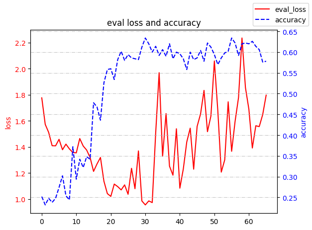

# LLMs微调

实现LLMs在阅读理解数据集ReClor上的微调。

|姓名|学号|班级|
|:-:|:-:|:-:|
|xxx|xxx|xxx|

## 一、基础知识

### 大语言模型微调

微调是在预训练模型的基础上，使用与最终应用直接相关的较小数据集进行训练，以更新模型的参数，使其更好地适应特定领域的细节和需求。这一过程可以比作将一个具有广泛知识的通才转变为一个专注于特定领域的专家。

微调大型语言模型（LLMs）是一个精细的过程，它涉及两个主要阶段：首先是使用大型预训练模型，其次是通过特定于目标任务或领域的数据集进行第二阶段的训练来更新模型的参数。这个过程允许模型学习并吸收特定于较小领域或任务的细微差别、模式和目标。

1. 预训练阶段：在这个阶段，模型从庞大且多样化的文本语料库中学习，获取广泛的语言理解能力。这为模型提供了一个坚实的基础，包括对语言的基本结构、语法、词汇以及不同话题的广泛知识。

2. 微调阶段：这个阶段专门针对提升模型在特定任务上的表现。通过在与最终应用直接相关的数据上进行训练，模型的权重被进一步调整，以更好地适应特定的数据分布和任务需求。

大语言模型的微调方法多种多样，主要包括以下几种：

1. 全微调（Full Fine-tuning）：将预训练模型的所有层都参与微调，以适应新的任务。这种方法适用于数据量足够大的情况。
   * 优点：能够充分利用预训练模型的知识，并在新任务上取得较好的性能。
   * 缺点：需要大量计算资源和时间，且存在灾难性遗忘的风险，即可能忘记预训练阶段学到的知识。
2. 部分微调：只微调预训练模型的部分层，包括微调顶层、冻结底层和逐层微调等方法。
   * 优点：可以减少计算资源的消耗，同时仍然允许模型有足够的灵活性来学习新任务。
   * 缺点：可能无法充分利用预训练模型的所有知识，且需要仔细选择哪些层进行微调。
3. 高效参数微调（PEFT）：针对全微调资源消耗大的问题，研究人员提出了多种高效参数微调技术，如Adapter Tuning、Prefix Tuning、Prompt Tuning和LoRA等。这些方法通过在模型中增加少量参数或修改输入层，来实现对模型的微调，同时保持大部分预训练参数不变。
   * 优点：能够显著减少计算资源的消耗，同时保持较好的性能。
   * 缺点：需要针对特定任务和模型进行设计和优化。

### LoRA微调

LoRA（Low-Rank Adaptation of LLMs，低秩适应）是一种参数高效微调技术，通过在预训练模型的每一层中引入可训练的低秩矩阵来实现模型的专业化，大大减少了可训练参数的数量。

LoRA背后的数学原理涉及低秩矩阵分解，其步骤如下：

1. 预训练权重矩阵：从维度为$d \times k$的预训练权重矩阵$W_0$开始。

2. 低秩分解：不是直接更新整个矩阵$W_0$，而是采用低秩分解方法。更新$W_0$至$W$可以表示为两个矩阵的乘积：$U$和$V$，其中$U$有尺寸$d \times r$，$V$有尺寸$r \times k$。关键点是$r$远小于$d$和$k$，允许更高效的计算。

3. 参数训练：在训练过程中，$W_0$保持不变（冻结权重），而$U$和$V$是可训练的参数。

4. 乘法和加法：$U$和$V$的乘积（即$U \cdot V$）与相同的输入相乘，然后将输出相加得到更新后的权重矩阵$ W$。

这个过程可以用以下方程式总结：$W = W_0 + U \cdot V$，其中$W$表示应用更新后的最终输出。

## 二、微调过程

这里选用服务器提供的`Llama2-7B`大语言模型在`ReClor`数据集上采用`LoRA`方式进行微调。

### 加载分词器

使用`transformers`库提供的`AutoTokenizer`自动识别加载分词器。

```python
from transformers import AutoTokenizer

tokenizer_path = "/data/homework0/models/Llama-2-7b-hf"
tokenizer = AutoTokenizer.from_pretrained(tokenizer_path)
tokenizer.pad_token_id =tokenizer.eos_token_id
tokenizer.pad_token =tokenizer.eos_token
```

### 数据预处理

`Reclor`数据集中每个数据项有`context`、`question`、`answers`三个文本项，这需要我们将其合并为一句话作为大语言模型的输入。

在合并时，需要我们增加一些分界信息，方便模型学习到输入的结构信息。

这里以训练集中的第一个数据项作为例子来介绍我的处理：

```json
{
  "context": "In rheumatoid arthritis, the body' s immune system misfunctions by attacking healthy cells in the joints causing the release of a hormone that in turn causes pain and swelling. This hormone is normally activated only in reaction to injury or infection. A new arthritis medication will contain a protein that inhibits the functioning of the hormone that causes pain and swelling in the joints.",
  "question": "The statements above, if true, most strongly support which one of the following conclusions?",
  "answers": [
    "Unlike aspirin and other medications that reduce pain and swelling and that are currently available, the new medication would repair existing cell damage that had been caused by rheumatoid arthritis.",
    "A patient treated with the new medication for rheumatoid arthritis could sustain a joint injury without becoming aware of it.",
    "Joint diseases other than rheumatoid arthritis would not be affected by the new medication.",
    "The benefits to rheumatoid arthritis sufferers of the new medication would outweigh the medication's possible harmful side effects."
  ],
  "label": 1,
  "id_string": "train_0"
}
```

经过处理后的句子为：

```text
Context: In rheumatoid arthritis, the body' s immune system misfunctions by attacking healthy cells in the joints causing the release of a hormone that in turn causes pain and swelling. This hormone is normally activated only in reaction to injury or infection. A new arthritis medication will contain a protein that inhibits the functioning of the hormone that causes pain and swelling in the joints. Question: The statements above, if true, most strongly support which one of the following conclusions? Option A: Unlike aspirin and other medications that reduce pain and swelling and that are currently available, the new medication would repair existing cell damage that had been caused by rheumatoid arthritis. Option B: A patient treated with the new medication for rheumatoid arthritis could sustain a joint injury without becoming aware of it. Option C: Joint diseases other than rheumatoid arthritis would not be affected by the new medication. Option D: The benefits to rheumatoid arthritis sufferers of the new medication would outweigh the medication's possible harmful side effects.
```

主要代码如下：

```python
from datasets import Dataset

def process_data(data_path, tokenizer, max_len):
    def process_single_data(single_data):
        text = "Context: " + single_data["context"] + " Question: " + single_data["question"]

        for index, option in enumerate(single_data["answers"]):
            text += " Option " + chr(index + 65) + ": " + option
        
        single_data = tokenizer(text, padding=True, truncation=True, return_tensors="pt", max_length=max_len)
        single_data['input_ids'] = single_data['input_ids'].squeeze(0)
        single_data['attention_mask'] = single_data['attention_mask'].squeeze(0)
        return single_data

    data = Dataset.from_json(data_path)
    data = data.map(process_single_data,  num_proc=8, remove_columns=["context", "question", "answers", "id_string"])
    data.set_format("torch")
    return data

train_dataset_path = "./reclor_data/train.json"
train_dataset = process_data(train_dataset_path, tokenizer, max_len)
```

同时还计算了四类选项的权重，以便后续在计算交叉熵的时候使用。

接着使用`transformers`库中的`DataCollatorWithPadding`作为数据整理器，以供后面的`DataLoader`使用。

```python
from transformers import DataCollatorWithPadding
data_collator = DataCollatorWithPadding(tokenizer=tokenizer)
```

### 模型量化压缩

在实际测试过程，发现模型不经过量化在训练过程会爆显存。所以这里使用了`transformers`库中的`BitsAndBytesConfig`进行量化。

```python
quant_config = BitsAndBytesConfig(
    load_in_4bit=True,
    bnb_4bit_use_double_quant=True,
    bnb_4bit_quant_type="nf4",
    bnb_4bit_compute_dtype=torch.bfloat16
)
```

### 加载基座模型

由于我们的任务相等于一个分类任务，所以这里直接使用了`transformers`库中提供的`AutoModelForSequenceClassification`来加载模型。

由于我们的任务每个题目中有四个选项，所以这里设置参数`num_labels`为`4`.

```python
llama_model = AutoModelForSequenceClassification.from_pretrained(
    llama_path,
    num_labels=4, # 每个题目有四个选项
    offload_folder="offload",
    quantization_config=quant_config, 
    device_map={"": 4}
)

llama_model.config.pad_token_id = llama_model.config.eos_token_id
```

### 配置LoRA获得微调模型

1. 寻找可以进行LoRA微调的模块

   ```python
   import bitsandbytes as bnb

   lora_module_names = set()
   for name, module in llama_model.named_modules():
      if isinstance(module, bnb.nn.Linear4bit):
         names = name.split('.')
         lora_module_names.add(names[0] if len(names) == 1 else names[-1])


   if 'lm_head' in lora_module_names: # needed for 16-bit or 32-bit
      lora_module_names.remove('lm_head')
   ```

2. 设置LoRA参数

   ```python
   from peft import LoraConfig, TaskType
   llama_peft_config = LoraConfig(
      task_type=TaskType.SEQ_CLS, r=16, lora_alpha=16, lora_dropout=0.05, bias="none",
      target_modules=list(lora_module_names),
   )
   ```

3. 在基座模型上注入LoRA模块

   这里直接使用`peft`库提供的`get_peft_model`方法直接得到微调模型。

   ```python
   from peft import get_peft_model, prepare_model_for_kbit_training

   llama_model = prepare_model_for_kbit_training(llama_model) 
   llama_model = get_peft_model(llama_model, llama_peft_config)
   llama_model.print_trainable_parameters()
   ```

### 训练模型

1. 可以使用`transformers`库提供的`TrainingArguments`、`Trainer`简化我们的训练过程。

   1. 自定义训练器：继承自`Trainer`并重写`compute_loss`方法。

      ```python
      class WeightedCELossTrainer(Trainer):
         def compute_loss(self, model, inputs, return_outputs=False):
            labels = inputs.pop("labels")
            # Get model's predictions
            outputs = model(**inputs)
            logits = outputs.get("logits")
            # Compute custom loss
            loss_fct = torch.nn.CrossEntropyLoss(weight=torch.tensor([option0_weights, option1_weights, option2_weights, option3_weights], device=labels.device, dtype=logits.dtype))
            loss = loss_fct(logits.view(-1, self.model.config.num_labels), labels.view(-1))
            return (loss, outputs) if return_outputs else loss
            
      ```

   2. 定义计算评估指标的方法

      ```python
      from datasets import load_metric

      # 加载预定义的指标，例如准确率
      accuracy_metric = load_metric('accuracy')
      precision_metric = load_metric("precision")
      recall_metric = load_metric("recall")
      f1_metric= load_metric("f1")


      def compute_metrics(eval_pred):
         logits, labels = eval_pred
         predictions = np.argmax(logits, axis=-1)
         precision = precision_metric.compute(predictions=predictions, references=labels)["precision"]
         recall = recall_metric.compute(predictions=predictions, references=labels)["recall"]
         f1 = f1_metric.compute(predictions=predictions, references=labels)["f1"]
         accuracy = accuracy_metric.compute(predictions=predictions, references=labels)["accuracy"]
         return {"precision": precision, "recall": recall, "f1-score": f1, 'accuracy': accuracy}
      ```

   3. 定义训练参数，并开始训练：参考该[链接](https://zhuanlan.zhihu.com/p/662619853)可以了解`TrainingArguments`和`Trainer`支持的参数。

      ```python
      lr = 1e-4
      batch_size = 2
      num_epochs = 3
      training_args = TrainingArguments(
         output_dir="./llama_lora_output",
         do_train=True,
         do_eval=True,
         learning_rate=lr,
         lr_scheduler_type= "constant",
         warmup_ratio= 0.1,
         max_grad_norm= 0.3,
         per_device_train_batch_size=batch_size,
         per_device_eval_batch_size=batch_size,
         num_train_epochs=num_epochs,
         weight_decay=0.001,
         eval_strategy="epoch",
         save_strategy="epoch",
         load_best_model_at_end=True,
         report_to="wandb",
         fp16=True,
         logging_steps=25,
         save_steps=0,
         gradient_checkpointing=True,
      )

      llama_trainer = Trainer(
         compute_metrics=compute_metrics,
         model=llama_model,
         args=training_args,
         train_dataset=train_dataset,
         eval_dataset=test_dataset,
         data_collator=data_collator,
      )

      llama_trainer.train()
      ```

   该方法在使用过程中没有额外的信息输出，我配置了很长时间没有解决该问题，所以这里手动编写了训练过程。

2. 自己编写训练过程。

   1. 数据迭代器、损失函数、优化器的准备。

      ```python
      train_dataloader = DataLoader(
         train_dataset, shuffle=True, collate_fn=data_collator, batch_size=batch_size, pin_memory=True
      )
      val_dataloader = DataLoader(
         val_dataset, collate_fn=data_collator, batch_size=batch_size, pin_memory=True
      )


      optimizer = torch.optim.AdamW(params=llama_model.parameters(), lr=lr)

      def compute_loss(model, inputs, return_outputs=False):
         labels = inputs.pop("labels")
         # Get model's predictions
         outputs = model(**inputs)
         logits = outputs.get("logits")
         # Compute custom loss
         loss_fct = torch.nn.CrossEntropyLoss(weight=torch.tensor([option0_weights, option1_weights, option2_weights, option3_weights], device=labels.device, dtype=logits.dtype))
         loss = loss_fct(logits.view(-1, model.config.num_labels), labels.view(-1))
         return (loss, outputs) if return_outputs else loss
      ```

   2. 开始训练：该过程和以往的模型训练过程大体相同，可以使用`torch.cuda.empty_cache()`在训练过程中清除缓存，防止爆显存。

      ```python
      train_hishory_loss = []
      eval_hishory_loss = []
      accuracy_history = []

      for epoch in range(num_epochs):
         torch.cuda.empty_cache()
         print("⬇️" * 30)
         llama_model.train()
         total_train_loss = 0
         for index, batch in enumerate(tqdm(train_dataloader, desc=f"Epoch {epoch + 1} while training")):
            torch.cuda.empty_cache()
            optimizer.zero_grad()
            batch = {k: v.to(device) for k, v in batch.items()}
            loss = compute_loss(llama_model, batch)
            loss.backward()
            optimizer.step()
            total_train_loss += loss.detach().float().cpu()
         
            if (index+1) % 400 == 0:
                  avg_loss = total_train_loss / len(train_dataloader)
                  train_hishory_loss.append(avg_loss.cpu())
                  print(f"\nAverage Loss: {avg_loss}\n")

                  print("❤️" * 30)

                  llama_model.eval()
                  eval_total_loss = 0
                  right_num = 0
                  with torch.no_grad():
                     torch.cuda.empty_cache()
                     for batch in tqdm(val_dataloader, desc=f"Epoch {epoch + 1} while evaluating"):
                        batch = {k: v.to(device) for k, v in batch.items()}

                        labels = batch.pop("labels")
                        outputs = llama_model(**batch)
                        logits = outputs.get("logits")

                        loss_fct = torch.nn.CrossEntropyLoss(weight=torch.tensor([option0_weights, option1_weights, option2_weights, option3_weights], device=labels.device, dtype=logits.dtype))
                        loss = loss_fct(logits.view(-1, llama_model.config.num_labels), labels.view(-1))
                        eval_total_loss += loss.detach().float().cpu()

                        preds = logits.argmax(-1)
                        right_num += torch.eq(labels, preds).sum().detach().float().cpu()


                     avg_loss = eval_total_loss / len(val_dataloader)
                     eval_hishory_loss.append(avg_loss.cpu())
                     accuracy = right_num / len(val_dataloader)
                     accuracy_history.append(accuracy.cpu())
                     print(f"\nAverage Loss: {avg_loss}\nAccuracy: {accuracy}\n")
      ```

### 模型的保存

训练过程结束后要记得保存模型。

```python
output_path = "./llama_output"
llama_model.save_pretrained(output_path)
```

## 三、训练过程和结果分析

刚开始时我训练了3轮，发现模型在验证集上准确率从开始的25%左右到达了60%左右。训练过程中的图像如下：


这时我想如果继续训练，准确率还能继续提升，于是我又开始了3轮训练。但是在这3轮训练中，我发现准确率最终在60%左右摆动，并没有显著提升。开始我以为这个准确率太低，经过询问老师，我得知60%是正常结果，于是模型没有继续调参训练。




最终经过微调，模型做选择题的准确率从原来的几乎是25%（1/4）升到了60%左右，这说明微调是有效果的。

## 四、感想

本次实验是我第一次接触大语言模型。它让我了解了`Hugging Face`这个网站，该网站提供了许多开源模型，包括图像模型、自然语言模型、音频模型等。同时`Hugging Face`也提供了一些`Python`包，这些包确实方便了模型的使用和训练，并提供了详细的文档。

`LLaMA`系列模型是由Meta发布的大语言模型，可以其称为开源大模型的鼻祖。现在的许多模型都是在其基础上进行微调所得的。

本次实验是我第一次训练这么耗时的模型，确实让我认识到大模型需要巨大的显存和大量训练时间。在训练过程中，时常会出现由于显卡被其他同学占用导致模型训练过程中爆显存而被迫停止，让我很无奈。而且刚开始时我的`batch_size`设置为2，刚开始训练的时候很正常，训练1小时后就会莫名奇妙出现显存不够的错误，所以最后我就设置了`batch_size`为1。

最后，感谢老师提供这么一个机会，让非人工智能专业的同学也可以提前接触到大语言模型！

## 五、参考资料

* [在灾难推文分析场景上比较用 LoRA 微调 Roberta、Llama 2 和 Mistral 的过程及表现](https://segmentfault.com/a/1190000044485544)

* [AIGC：【LLM（一）】——LoRA微调加速技术](https://www.skycaiji.com/aigc/ai2977.html)

## 六、附录

* **代码**：fine_tuning.ipynb
