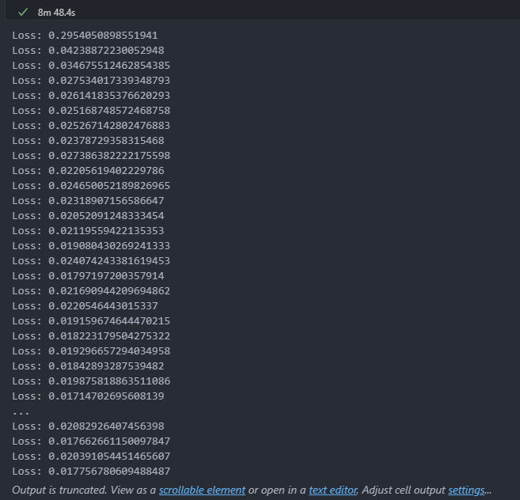
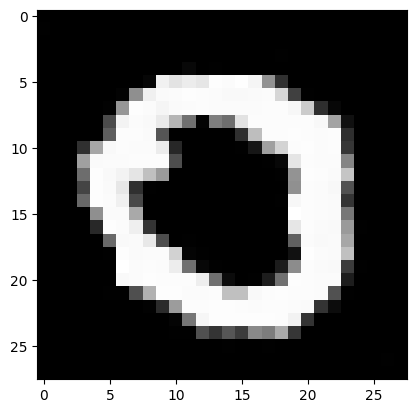
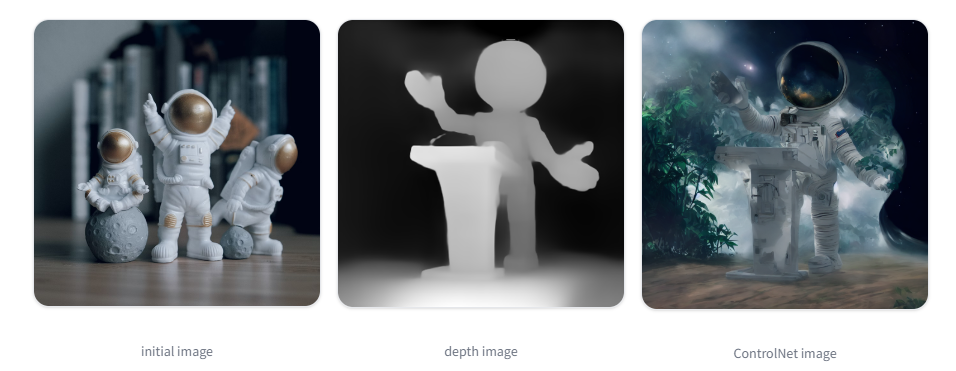
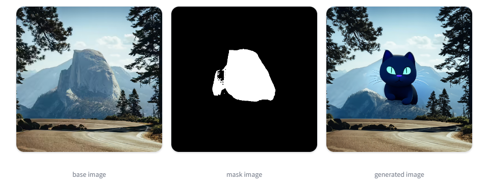
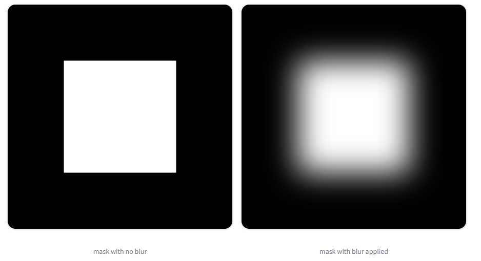
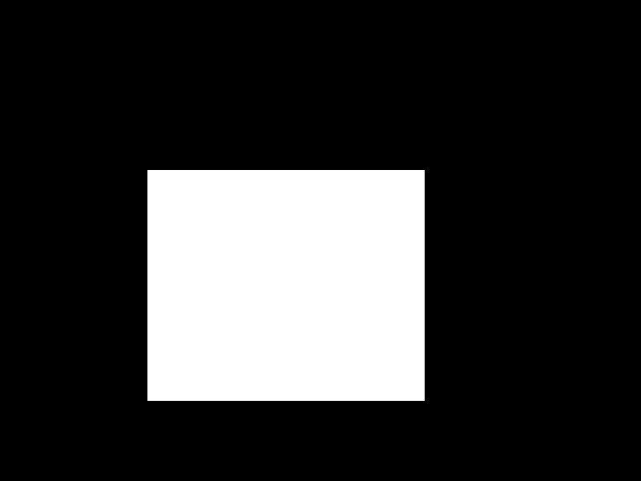

# 扩散模型

实现扩散模型的训练与采样。

|姓名|学号|班级|
|:-:|:-:|:-:|
|xxx|xxx|xxx|

## 一、扩散模型基本原理

扩散模型（Diffusion Models）的基本原理可以归纳为两个主要过程：正向扩散过程和反向扩散过程。

1. 正向扩散过程

    正向扩散过程是从原始数据开始，逐步向其添加噪声，使数据逐渐变得模糊的过程。这一过程可以理解为对数据的“破坏”，其目的是使数据在噪声的干扰下逐渐接近一个简单的分布（如标准正态分布）。

    * 起始状态：以一个清晰的、未加噪的数据（如一张图像）作为起始点。
    * 加噪过程：该过程被分为离散的多个时间步（$T$步），在每个时间步$t$，给上一个时间步$t-1$的数据添加高斯噪声，从而生成带有噪声的数据$x_t$。这一过程是逐步进行的，随着时间的推移，数据中的噪声越来越多，数据逐渐变得模糊，最终接近高斯噪声分布。

2. 反向扩散过程

    反向扩散过程是在正向扩散过程的基础上，学习从噪声中恢复出原始数据的过程。这是扩散模型的核心，也是生成图像的关键。

    * 起始状态：以服从高斯噪声分布的数据作为起始点。
    * 去噪过程：该过程也是逐步进行的，通过一系列逆步骤逐步去除噪声，使数据逐渐恢复到原始状态。每一步都依赖于前一步的输出，并学习如何减少噪声同时保留有意义的结构和特征。

扩散模型的优化目标通常是最小化噪声残差，即要求反向过程中预测的噪声分布与正向过程中施加的噪声分布之间的“距离”最小。这样，反向去噪过程得到的数据就能最接近原始数据。

## 二、实现扩散模型的训练和采样

这里根据老师给出的[参考链接](https://huggingface.co/blog/annotated-diffusion)，做了一些修改，从而实现了扩散模型的训练和采样。

做的修改如下：

1. 更改数据集

    ```python
    dataset = load_dataset("mnist", trust_remote_code=True)
    ```

2. 根据自己电脑配置修改`batch_size`和`epochs`

3. 修改`save_and_sample_every`从而可以保存中间训练结果

我在自己电脑上训练了一个扩散模型。训练过程如下：



并进行采样，得到的结果如下：




## 三、图片去噪准备

### Pileline的参数解析

* **guidance_scale**：**提示**对图像生成的影响程度，较低的值赋予模型“创造力”，以生成与提示关系更松散的图像；较高的guidance_scale值推动模型更紧密地跟随提示，如果该值过高，可能会观察到生成图像中的一些伪影。

* **generator**：通过设置手动种子来实现管道中的可重复性，使用生成器创建图像每次都应返回相同的结果，而不是随机生成新图像。

* **width**、**height**：输出图像的大小

* **prompt**：输出图片的提示词

* **negative_prompt**：不希望出现在图片中的提示词，它可用于改进画质或修改图像

* **strength**：决定了生成的图像与**初始图像**的相似程度。较低的强度值意味着生成的图像与初始图像更相似，1表示初始图像几乎被忽略了。

* **padding_mask_crop**：此选项使用一些用户指定的填充裁剪蒙版区域。

### Image-to-image

图像到图像类似于文本到图像，但是除了`prompt`之外，还可以传递一个初始图像作为扩散过程的起点。初始图像被编码到潜在空间并添加噪声。然后潜在扩散模型接受提示和有噪声的潜在图像，预测添加的噪声，并从初始潜在图像中去除预测的噪声以获得新的潜在图像。最后，解码器将新的潜在图像解码回图像。

图像去噪任务就属于这种类型，这时可以使用`diffusers`库提供的`AutoPipelineForImage2Image`方便加载模型。

```python
model_path = "/data/homework0/wyt/models--CompVis--stable-diffusion-v1-4/snapshots/133a221b8aa7292a167afc5127cb63fb5005638b"
device = 'cuda:3' if torch.cuda.is_available() else 'cpu'

pipeline = AutoPipelineForImage2Image.from_pretrained(
    model_path,
    torch_dtype=torch.float16,
).to(device)

pipeline.enable_model_cpu_offload()
```

### 管道Pipeline

一个模型的输出作为下一个模型的输入。在图生图任务中，需要注意在管道中指定`output_type="latent"`以将所有输出保持在潜在空间中以避免不必要的解码-编码步骤。

### 提高图像生成效果的方法

1. **提示加权**：提示加权是一种增加或减少提示中概念重要性的技术，以强调或最小化图像中的某些特征。

    使用[`Compel`](https://github.com/damian0815/compel)库来方便该操作。

    使用示例如下：

    ```python
    from diffusers import StableDiffusionPipeline
    from compel import Compel

    pipeline = StableDiffusionPipeline.from_pretrained("runwayml/stable-diffusion-v1-5")
    compel = Compel(tokenizer=pipeline.tokenizer, text_encoder=pipeline.text_encoder)

    # upweight "ball"
    prompt = "a cat playing with a ball++ in the forest"
    conditioning = compel.build_conditioning_tensor(prompt)
    # or: conditioning = compel([prompt])

    # generate image
    images = pipeline(prompt_embeds=conditioning, num_inference_steps=20).images
    images[0].save("image.jpg")
    ```

2. ControlNet

    ControlNet提供了一种更灵活和准确的方式来控制图像生成，因为可以使用额外的调节图像。调节图像可以是精巧的图像、深度图、图像分割或涂鸦。ControlNet会生成一个保留调节图像信息的图像。

    使用示例如下：

    ```python
    from diffusers import ControlNetModel, AutoPipelineForImage2Image
    import torch

    controlnet = ControlNetModel.from_pretrained("lllyasviel/control_v11f1p_sd15_depth", torch_dtype=torch.float16, variant="fp16", use_safetensors=True)
    pipeline = AutoPipelineForImage2Image.from_pretrained(
        "runwayml/stable-diffusion-v1-5", controlnet=controlnet, torch_dtype=torch.float16, variant="fp16", use_safetensors=True
    )
    prompt = "Astronaut in a jungle, cold color palette, muted colors, detailed, 8k"
    image_control_net = pipeline(prompt, image=init_image, control_image=depth_image).images[0]
    ```

    

### 图像修复（Inpainting）

图像修复依赖于蒙版（mask）来确定要填充图像的哪些区域；**要修复的区域由白色像素表示，要保留的区域由黑色像素表示**。白色像素由提示填充。

使用示例如下：

```python
import torch
from diffusers import AutoPipelineForInpainting
from diffusers.utils import load_image, make_image_grid

pipeline = AutoPipelineForInpainting.from_pretrained(
    "runwayml/stable-diffusion-inpainting", torch_dtype=torch.float16, variant="fp16"
)
pipeline.enable_model_cpu_offload()

prompt = "a black cat with glowing eyes, cute, adorable, disney, pixar, highly detailed, 8k"
negative_prompt = "bad anatomy, deformed, ugly, disfigured"
image = pipeline(prompt=prompt, negative_prompt=negative_prompt, image=init_image, mask_image=mask_image).images[0]
make_image_grid([init_image, mask_image, image], rows=1, cols=3)
```



可以通过如下代码设置蒙版的模糊程度。`blur_factor`的值越大越模糊。

```python
import torch
from diffusers import AutoPipelineForInpainting
from diffusers.utils import load_image
from PIL import Image

pipeline = AutoPipelineForInpainting.from_pretrained("runwayml/stable-diffusion-v1-5", torch_dtype=torch.float16).to('cuda')

mask = load_image("https://huggingface.co/datasets/YiYiXu/testing-images/resolve/main/seashore_mask.png")
blurred_mask = pipeline.mask_processor.blur(mask, blur_factor=33)
```



使用如下代码强制不修改蒙版以外的图像。

```python
unmasked_unchanged_image = pipeline.image_processor.apply_overlay(mask_image, init_image, repainted_image)
unmasked_unchanged_image.save("force_unmasked_unchanged.png")
```

`Hugging Face`官网提供了生成蒙版的[工具](https://huggingface.co/docs/diffusers/main/en/using-diffusers/inpaint#create-a-mask-image)。

## 三、使用预训练好的扩散模型实现图片去噪

图片去噪任务属于**图生图**类型的任务，这里参考`Hugging Face`网站上的文档[Image-to-image](https://huggingface.co/docs/diffusers/using-diffusers/img2img)和[Inpainting](https://huggingface.co/docs/diffusers/main/en/using-diffusers/inpaint)来实现该任务。

### 素材准备

使用`PhotoShop`对图像打马赛克，并获得蒙版。

* **原始图片**


* **蒙版**



* **模型输入图片**


### 调参过程


* prompt：""
* negative_prompt："mosaic, noise"
* guidance_scale：10
* generator：torch.Generator(device).manual_seed(100)
* num_inference_steps：80
* strength：0.46


* prompt：""
* negative_prompt："mosaic, noise"
* guidance_scale：10
* generator：torch.Generator(device).manual_seed(100)
* num_inference_steps：80
* strength：0.5


* prompt："smile"
* negative_prompt："mosaic, noise"
* guidance_scale：10
* generator：torch.Generator(device).manual_seed(100)
* num_inference_steps：80
* strength：0.5


* prompt："smile, smooth face"
* negative_prompt："mosaic, noise, low quality, aliasing, blurry, bad lighting, bad anatomy, poorly drawn face"
* guidance_scale：5
* generator：torch.Generator(device).manual_seed(100)
* num_inference_steps：120
* strength：0.5


* prompt："smile, smooth face"
* negative_prompt："mosaic, noise, low quality, aliasing, blurry, bad lighting, bad anatomy, poorly drawn face"
* guidance_scale：4
* generator：torch.Generator(device).manual_seed(100)
* num_inference_steps：200
* strength：0.5

最终去噪后的图片：


## 四、感想

本次实验代码量较小，但是在没有找到`Hugging Face`这个网站前，我对该怎么做感到一头雾水，在看了`Hugging Face`的文档后，有关API的问题就很简单了。

本次实验需要调节多个参数，逐步尝试以达到最好的效果。虽然使用**ControlNet**、**其他特定用途的模型**或者**管道模型**可能会更适合图像去噪这类任务，但是由于服务器不能翻墙，模型需要从本地上传到服务器，所以我并没有进行这些尝试。

在网上搜索有关`Diffusion`模型时，我发现对于参数的设置有很多的技巧，这需要更深入的了解。

## 五、附录

* **在mnist数据集上进行扩散模型的训练和采样**：dm_mnist.ipynb
* **图像去噪**：dm_remove_noise.ipynb
