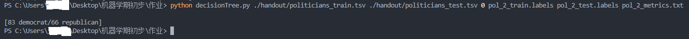

# 决策树实验报告

|姓名|学号|
|:-:|:-:|
|xxx|xxx|

## 一、基础知识

决策树是一种常用的**监督学习**算法，它主要用于分类和回归问题。决策树模型通过树状图的形式，将数据按照某种规则划分为不同的子集，从而实现对数据的分类或预测。

1. 基本原理
    决策树基于树形结构进行决策，每个内部节点表示一个属性上的判断条件，每个分支代表某个条件可能的取值，每个叶节点代表一个类别。从根节点到叶节点的路径表示一条分类规则。决策树通过不断地将数据集划分为更小的子集，直到满足某个停止条件（如子集内的样本都属于同一类别或子集的大小小于预设阈值）为止。

2. 构建过程
决策树的构建过程主要包括以下步骤：

   * 特征选择：从数据集中选择一个最优特征作为当前节点的分裂标准。常用的特征选择方法有信息增益、信息增益比、基尼指数等。
   * 决策树生长：根据所选特征的不同取值，将数据集划分为多个子集，并为每个子集创建一个新的子节点。然后，对每个子节点递归地执行步骤1和步骤2，直到满足停止条件。
   * 剪枝：为了避免过拟合，可以对决策树进行剪枝操作。剪枝包括预剪枝和后剪枝两种方法。预剪枝是在决策树生长过程中提前停止树的构建，而后剪枝是在决策树构建完成后对其进行简化。

3. 优缺点

   * 决策树的优点包括：
     * 易于理解和解释：决策树模型以树状图的形式呈现，直观易懂，方便用户理解模型的工作原理。
     * 可处理非数值型数据：决策树可以处理离散型、连续型以及混合类型的数据。
     * 鲁棒性好：决策树对噪声数据和缺失值具有一定的容忍度。
   * 决策树的缺点包括：
     * 容易过拟合：当决策树的深度过大时，模型可能过于复杂，导致对训练数据的拟合过好，而对新数据的泛化能力较差。
     * 不稳定：决策树对训练数据的敏感性较高，不同的训练数据可能导致完全不同的决策树结构。

## 二、分类器的设计和实现

### 分类器一

这个分类器使用了多数投票法（majority vote）来进行分类，其主要原理为：选择原数据集中标签中出现数目最多的类别作为预测结果。

具体过程如下：

1. 读取“tsv”文件，获取最后一列即标签所在列的数据。
2. 对该列数据进行统计，计算出各种类别出现的次数，进而计算出各种类别出现的概率。
3. 计算交叉熵和错误率。

```python
def inspect(input_file_path, output_file_path):
    # 读取 tsv 文件
    df = pd.read_csv(input_file_path, sep='\t')
    # 获取最后一列
    last_column = df.iloc[:, -1]
    # 统计各种元素值出现的次数
    counts = last_column.value_counts().values 
    # 计算各种类型出现的概率
    probabilities = counts / counts.sum()
    # 采用 majority vote 获得的错误率
    error_rate = 1 - probabilities.max()
    # 计算熵
    entropy = - np.sum(probabilities * np.log2(probabilities))

    with open(output_file_path, 'w') as output:
        output.write(f'entropy: {entropy}\n')
        output.write(f'error: {error_rate}\n')
```

### 分类器二

这个分类器采用决策树来进行分类，其介绍和原理在第一部分已经说明过了。

接下来具体阐述该部分的具体实现过程：

1. 计算给定样本集的熵：`cal_entropy`
    具体过程为读取样本集最后一列，即标签所在的列，然后计算各种元素出现的次数，进而计算各种元素出现的概率，最后通过公式来计算该样本集的熵。

    $$
    H(X) = -\sum{p(x)\log{p(x)}}
    $$

    ```python
    def cal_entropy(data: pd.DataFrame):
        """ 
        计算给定样本的熵
        """
        # 获取最后一列
        last_column = data.iloc[:, -1]
        # 统计各种元素值出现的次数
        counts = last_column.value_counts().values 
        # 计算各种类型出现的概率
        probabilities = counts / counts.sum()
        # 计算熵
        entropy = - np.sum(probabilities * np.log2(probabilities))
        return entropy
    ```

2. 根据特征分割样本集：`split_data`
    将样本集根据某一特征进行分组，返回这一样本集在该特征上的取值和子样本集。

    ```python
    def split_data(data: pd.DataFrame, feature: str) -> list:
        """
        根据某一特征将数据划分为两部分
        """
        # 按照某一列进行分组
        groups = data.groupby(feature)
        res = []
        for value, group in groups:
            res.append((value, group))
        return res
    ```

3. 计算信息增益：`cal_information_gain`
    信息增益也就是作业中的`mutual information`，其值为父代样本集的熵减去父代样本集根据某一特征划分后的子代样本集的熵的加权和，具体公式如下：

    $$
    IG(D, a) = H(D) - H(D | a)
    $$

    ```python
    def cal_information_gain(data: pd.DataFrame, feature: str):
        """ 
        计算信息增益，也就是作业中的 mutual information 
        feature: 进行分类的特征
        """
        parent_entropy = cal_entropy(data)
        parent_num = data.shape[0]
        
        IG = parent_entropy
        for value, child_data in split_data(data, feature):
            child_num = child_data.shape[0]
            IG -=  child_num / parent_num * cal_entropy(child_data)
        return IG
    ```

4. 选择样本集下的最优划分特征：`get_feature_to_split`
    遍历样本集的特征，计算每个特征的信息增益，选择其中使信息增益最大的特征并返回，注意当所有`IG`都小于$0$，则返回**空串**；如果有相同的最大`IG`将返回第一个特征。

    ```python
    def get_feature_to_split(data: pd.DataFrame) -> str:
        """
        获取当前样本集下的最优划分特征
        注意：如果 IG 都小于0，则返回 *空串*；相同 IG 将返回第一个特征
        """
        IG = 0
        res = ''
        for feature in data.columns.values[:-1]:
            if cal_information_gain(data, feature) > IG:
            IG = cal_information_gain(data, feature)
            res = feature 
        
        return res
    ```

5. 获取决策树的叶节点所代表的标签值：`get_major_label`
    对于决策树的叶节点采用**多数投票法**来获取该叶节点所代表的标签值；注意，如果数目相等则按字典序逆序返回。

    ```python
    def get_major_label(data: pd.DataFrame) -> str:
        """
        对于决策树的叶节点采用 majority vote 来获取标签值
        注意：如果数目相等则按字典序逆序返回
        """
        # 获取最后一列
        last_column = data.iloc[:, -1]
        # 统计各种标签值出现的次数，value_counts()默认按降序排序
        counts = last_column.value_counts()

        right = 0
        # 找到和出现次数最多的多个标签，right表示右开区间
        for count in counts:
            if count == counts.iloc[0]:
                right += 1

        return counts.index[:right].max()
    ```

6. 递归创建决策树：`create_decision_tree`
    使用递归的方法创建决策树，并使用字典这一数据结构来存储决策树。具体过程如下：
    * 判断当前的树的深度是否大于等于给定的要求，如果成立则调用`get_major_label`函数来获取该子节点所表示的标签类型并返回。
    * 否则调用`get_feature_to_split`函数来获取可以使分割样本集后获得最大的信息增益的特征
      * 如果该函数返回**空串**，表示该样本集所有个体的标签值都相同，可以结束递归，调用`get_major_label`函数来获取该子节点所表示的标签类型并返回。
      * 否则，得到最好的特征来分割样本集。
    * 遍历分割后的子样本集，然后在子样本集上递归调用`create_decision_tree`来继续生成决策树。

    ```python
    def create_decision_tree(data: pd.DataFrame, labels: pd.Series, max_depth: int, current_depth: int = 0):
        """
        生成决策树
        这里的labels参数是为了打印决策树而设置的，如果只是创建决策树并不需要该参数
        """
        if current_depth == 0:
            data_counts = data.iloc[:, -1].value_counts().sort_index()
            labels_counts = labels.value_counts().sort_index()
            label_1 = labels_counts.index[0]
            label_2 = labels_counts.index[1]
            print(f"\n[{data_counts.get(label_1, 0)} {label_1}/{data_counts.get(label_2, 0)} {label_2}]")

        if current_depth >= max_depth:
            # 当前深度大于最大深度则递归结束
            return get_major_label(data)

        # 选择要拆分而使用的特征
        feature = get_feature_to_split(data)
        if feature == '':
            # 如果 IG 为 0 则递归结束
            return get_major_label(data)
        
        # 使用字典来存储决策树，{'特征': {'特征值1': {...}, '特征值2': {...}}}
        decision_tree = {feature : {}}

        for value, sub_data in split_data(data, feature):
            print(f"{(current_depth+1)*"| "}{feature} = {value}: ", end="")
            # 统计data各种元素值出现的次数
            data_counts = sub_data.iloc[:, -1].value_counts().sort_index()
            labels_counts = labels.value_counts().sort_index()
            label_1 = labels_counts.index[0]
            label_2 = labels_counts.index[1]
            print(f"[{data_counts.get(label_1, 0)} {label_1}/{data_counts.get(label_2, 0)} {label_2}]")
            # 递归生成决策树
            decision_tree[feature][value] = create_decision_tree(sub_data, labels, max_depth, current_depth + 1)

        return decision_tree
    ```

7. 预测：`predict`和`predict_dataset`
    其中`predict`对单个样本进行预测，`predict_dataset`对样本集中每个样本调用`predict`来进行预测，并将其返回值加入到列表中并作为返回值返回。

    接下来对`predict`函数进行具体说明：
    * 首先判断传入的决策树是字典还是字符串，如果是字符串表示该决策树的高度为0，即退化成第一个问题中的对样本集直接使用多数投票法来进行预测。
    * 否则遍历当前决策树字典的键值，找出其中键值与当前样本相应特征相等的分支，并**递归**调用`predict`来继续进行判断。

    ```python
    def predict(sample: list, feature_names: list, decision_tree: dict | str) -> str:
    """ 
    根据决策树获得 *单个* 样本的标签值
    """
    if type(decision_tree) == str:
        # 如果决策树的高度为0，则直接返回
        return decision_tree
    
    root_feature = list(decision_tree.keys())[0]
    root_dict = decision_tree[root_feature]

    for value in root_dict.keys():
        if sample[feature_names.index(root_feature)] == value:
            if type(root_dict) == dict: # 如果该特征值value对应的字典值是一个字典则继续递归向决策树下面的节点查询
                label = predict(sample, feature_names, root_dict[value])
            else: # 如果该特征值value对应的字典值是一个值，则该值就是要查找的标签
                label = root_dict[value]

    return label
    ```

## 三、实验结果与分析

### 实验结果截图





### 实验分析

* 决策树的深度：当决策树的深度为$0$时，就退化成为特殊的多数投票法，即在原样本集上选择出现数目最多的标签值作为将来的预测值。
* 决策树的准确率：在`mushroom`数据集上进行训练和测试。

    |决策树深度|训练集上错误率|测试集上错误率|
    |:-:|:-:|:-:|
    |0|0.3866666666666667|0.751412429378531|
    |1|0.1146666666666667|0.5028248587570621|
    |2|0.06000000000000005|0.016949152542372836|
    |3|0.022666666666666613|0.020715630885122405|
    |4|0.01733333333333331|0.020715630885122405|
    |5|0.0|0.020715630885122405|
    |6|0.0|0.020715630885122405|

    1. 可以看到，随着决策树深度的增加，训练集上的错误率呈现下降趋势，但是测试集上的错误率先下降后上升，这说明决策树出现了过拟合
    2. 这意味着并不是决策树的深度越深越好，而是要根据模型复杂度和过拟合之间进行权衡考虑，来选择合适的决策树深度。

> 需要注意到，过拟合与泛化能力之间存在权衡关系。在实际应用中，我们需要根据具体情况调整模型的复杂度，以取得较好的泛化能力。

## 四、实验感想

通过本次实验，我验证了决策树算法在分类问题中的有效性，并分析了其性能特点。实验结果表明，决策树算法能够准确地对数据进行分类，并具有较好的泛化能力。同时，我也认识到了特征选择和过拟合对模型性能的影响。

本次决策树实验让我学会了之前很多不知道的东西，如：

1. 对于**树**这种数据结构可以使用字典这种数据类型来存储，这让之前不知道没有指针的$python$如何实现树的我醍醐灌顶。
2. 对$python$中常见的库$pandas$、$numpy$有了初步认识掌握。
3. 对于决策树的具体原理和实现有了更为深刻的认识和理解。
